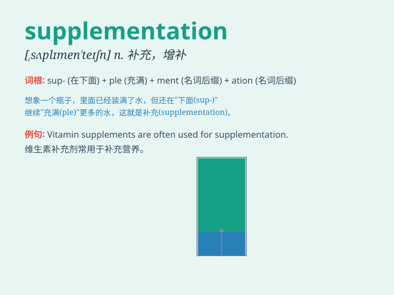

## supplementation

**英音:** _[ˌsʌplɪmenˈteɪʃn]_ **美音:**
_[ˌsʌplɪmenˈteɪʃn]_

**译义:** *n.增补,补充,追加*

### 短语

+ **nutritional supplementation:** _营养补充_

+ **dietary supplementation:** _饮食补充_

+ **vitamin supplementation:** _维生素补充_

+ **mineral supplementation:** _矿物质补充_

+ **protein supplementation:** _蛋白质补充_

### 例句

#### 例句1

> **The doctor recommended supplementation with vitamin D for better
bone health.**

**中文翻译:** 医生建议补充维生素 D 以促进骨骼健康。

**单词释义:** 补充；增补

#### 例句2

> **Supplementation of essential amino acids is important for
athletes.**

**中文翻译:** 对运动员来说，补充必需氨基酸很重要。

**单词释义:** 补充；增补

#### 例句3

> **Dietary supplementation can help fill nutritional gaps.**

**中文翻译:** 膳食补充可以帮助填补营养缺口。

**单词释义:** 补充；增补

### 背诵小故事

> A poor man was weak and often ill. A doctor suggested
supplementation. So he started taking vitamins and minerals. Gradually,
he became stronger and healthier.

**一个穷人身体虚弱且经常生病。一位医生建议补充营养。于是他开始服用维生素和矿物质。渐渐地，他变得更强壮、更健康了。**

### 图义

