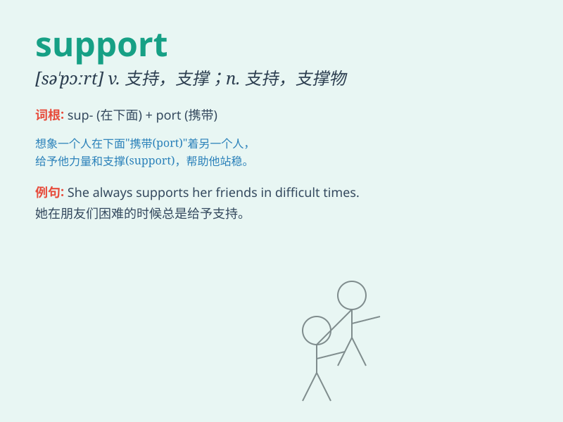

## support

**英音:** _[sə\'pɔːt]_ **美音:** _[sə\'pɔrt]_

**译义:**
*vt.支撑,扶持,支持,支援,拥护,维持,赡养,忍受n.支撑,支持,支援,维持,赡养,支持者,支柱*

### 短语

+ **give support:** _给予支持_

+ **in support of:** _支持；拥护_

+ **support oneself:** _自食其力_

+ **technical support:** _技术支持_

+ **moral support:** _精神支持；道义支持_

### 例句

#### 例句1

> **The government provides support to those in need.**

**中文翻译:** 政府为那些有需要的人提供支持。

**单词释义:** 支持；支援

#### 例句2

> **I need your support to finish this project.**

**中文翻译:** 我需要你的支持来完成这个项目。

**单词释义:** 支持；帮助

#### 例句3

> **The chair can\'t support his weight.**

**中文翻译:** 这把椅子承受不了他的体重。

**单词释义:** 承受；支撑

### 背诵小故事

> One day, Tom was climbing a mountain. It was very difficult and he
felt tired. Just when he wanted to give up, his friends came and gave
him support. They held his hands and helped him reach the top.

**一天，汤姆正在爬山。这非常困难，他感到很累。就在他想要放弃的时候，他的朋友们来了并且给他支持。他们握住他的手，帮助他到达了山顶。**

### 图义

