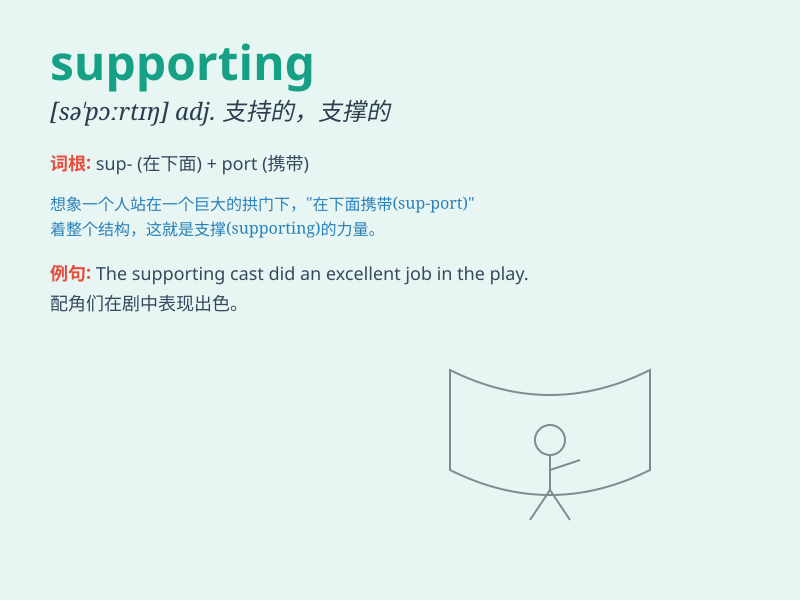

## supporting

**英音:** _[səˈpɔː.tɪŋ]_ **美音:** _[səˈpɔrt.ɪŋ]_

**译义:**
*支持的；支援的；起支撑作用的（形容词），或表示正在进行支持的动作（现在分词）*

### 短语

+ **supporting evidence:** _支持性证据；佐证_

+ **supporting role:** _配角；支持角色_

+ **supporting structure:** _支撑结构_

+ **supporting document:** _证明文件；支持文件_

+ **supporting actress:** _女配角_

### 例句

#### 例句1

> **The supporting actress gave a wonderful performance.**

**中文翻译:** 这位配角女演员表演得很精彩。

**单词释义:** 配角的；辅助的

#### 例句2

> **We need some supporting evidence to prove our point.**

**中文翻译:** 我们需要一些支持性的证据来证明我们的观点。

**单词释义:** 支持的；支撑的

#### 例句3

> **The supporting structure of the building is very strong.**

**中文翻译:** 这座建筑的支撑结构非常坚固。

**单词释义:** 支撑的；承重的

### 背诵小故事

> A little bird was injured and couldn\'t fly. Many kind people came to
its aid, providing food and a warm place. Their actions were like
supporting beams, giving the bird hope and strength. This is what
\'supporting\' means - giving help and strength.

**一只小鸟受伤无法飞翔。许多善良的人前来帮助它，提供食物和温暖的地方。他们的行动就像支撑的梁柱，给小鸟带来希望和力量。这就是\'supporting\'的意思 -
给予帮助和支持。**

### 图义

