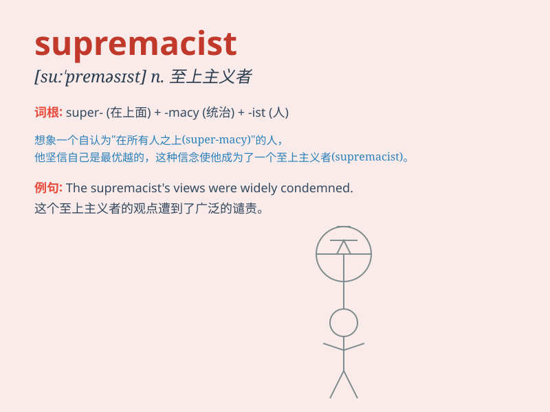

## supremacist

**英音:** _[suː\'preməsɪst; sjuː-]_ **美音:**
_[su\'prɛməsɪst]_

**译义:** * n[画]至上主义者*

### 短语

+ **white supremacist:** _白人至上主义者_

+ **racial supremacist:** _种族至上主义者_

+ **male supremacist:** _男性至上主义者_

+ **ethnic supremacist:** _民族至上主义者_

+ **religious supremacist:** _宗教至上主义者_

### 例句

#### 例句1

> **The white supremacist was arrested for his hate speech.**

**中文翻译:** 这个白人至上主义者因他的仇恨言论而被捕。

**单词释义:** 主张种族优越的人

#### 例句2

> **We must stand against all forms of supremacist ideology.**

**中文翻译:** 我们必须反对一切形式的至上主义意识形态。

**单词释义:** 至上主义者

#### 例句3

> **The supremacist group was banned by the government.**

**中文翻译:** 这个至上主义团体被政府取缔了。

**单词释义:** 种族优越论者

### 背诵小故事

> A group of bad guys called themselves supremacists. They thought they
were better than everyone else and wanted to rule the world. But in the
end, justice prevailed and their evil plan failed.

**一群坏人自称为至上主义者。他们认为自己比其他人都优越，还想统治世界。但最终，正义获胜，他们的邪恶计划失败了。**

### 图义

