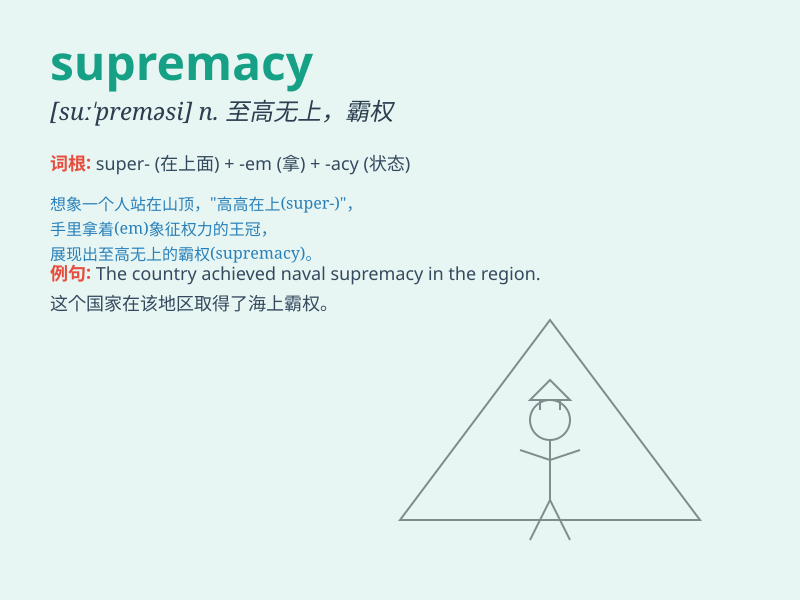

## supremacy

**英音:** _[s(j)uː\'preməsɪ]_ **美音:** _[su\'prɛməsi]_

**译义:** *n.地位最高的人,至高,无上,霸权*

### 短语

+ **racial supremacy:** _种族优越_

+ **military supremacy:** _军事霸权_

+ **air supremacy:** _制空权_

+ **naval supremacy:** _制海权_

+ **achieve supremacy:** _获得霸权_

### 例句

#### 例句1

> **The country sought military supremacy in the region.**

**中文翻译:** 这个国家寻求在该地区的军事霸权。

**单词释义:** 霸权；至高无上

#### 例句2

> **The team\'s supremacy in the sport was unquestionable.**

**中文翻译:** 这个队在该项运动中的优势是毋庸置疑的。

**单词释义:** 优势；最高地位

#### 例句3

> **He claimed supremacy over all his rivals.**

**中文翻译:** 他声称自己凌驾于所有对手之上。

**单词释义:** 凌驾；最高权力

### 背诵小故事

> In a faraway kingdom, there was a fierce battle for supremacy. Two
powerful lords fought hard, but in the end, one emerged victorious,
achieving absolute supremacy and ruling the land peacefully.

**在一个遥远的王国，有一场争夺霸权的激烈战斗。两位强大的领主奋力战斗，但最终，一人胜出，获得了绝对的霸权，和平地统治着这片土地。**

### 图义

