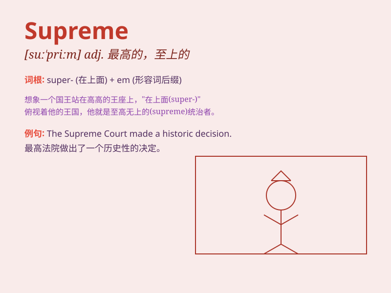

## Supreme

**英音:** _[suːˈpriːm]_ **美音:** _[suːˈpriːm]_

**译义:**
*adj.最高的；极大的；最重要的；（程度）很大的；终极的；至上的；崇高的；n.至高；霸权*

### 短语

+ **Supreme Court:** _最高法院_

+ **Supreme Being:** _上帝；至高无上的存在_

+ **Supreme Commander:** _最高指挥官_

+ **Supreme Leader:** _最高领导人_

+ **Supreme Quality:** _卓越品质；顶级质量_

### 例句

#### 例句1

> **The Supreme Court made a landmark decision.**

**中文翻译:** 最高法院做出了一个具有里程碑意义的决定。

**单词释义:** 最高的；至高的

#### 例句2

> **She achieved supreme success in her career.**

**中文翻译:** 她在事业上取得了极大的成功。

**单词释义:** 最大的；极度的

#### 例句3

> **The supreme leader addressed the nation.**

**中文翻译:** 最高领导人向全国发表了讲话。

**单词释义:** 最高的；最重要的

### 背诵小故事

> Once upon a time, a king wore a special crown labeled \'Supreme\'. It
meant he had the highest and most powerful position. Everyone respected
him as the Supreme ruler.

**从前，有一位国王戴着一顶标有'Supreme'的特殊王冠。这意味着他拥有最高且最强大的地位。每个人都尊他为至高无上的统治者。**

### 图义

