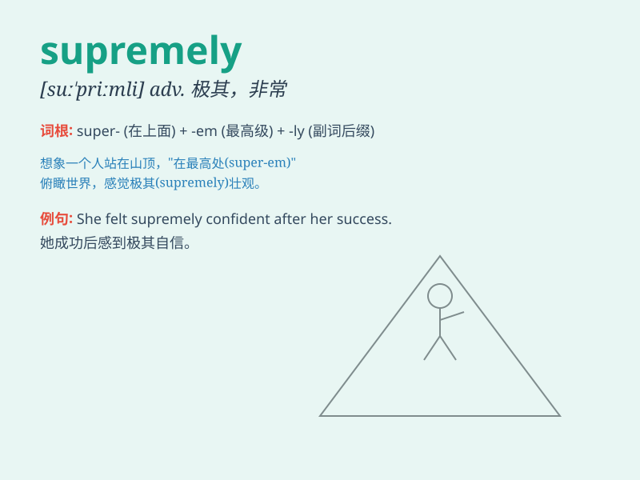

## supremely

**英音:** _[suːˈpriːmli]_ **美音:** _[suːˈpriːmli]_

**译义:** *adv.无上地,崇高地*

### 短语

+ **supremely confident:** _极度自信_

+ **supremely talented:** _极具天赋_

+ **supremely important:** _极其重要_

+ **supremely difficult:** _极度困难_

+ **supremely happy:** _极其快乐_

### 例句

#### 例句1

> **She is supremely confident in her abilities.**

**中文翻译:** 她对自己的能力极其自信。

**单词释义:** 极其；极度地

#### 例句2

> **The view from the top of the mountain is supremely beautiful.**

**中文翻译:** 从山顶看到的景色极其美丽。

**单词释义:** 极其；极度地

#### 例句3

> **He performed supremely well in the competition.**

**中文翻译:** 他在比赛中表现得极为出色。

**单词释义:** 极其；极度地

### 背诵小故事

> A young artist strived to create the supreme painting. He faced many
difficulties but remained supremely confident. Finally, his masterpiece
amazed everyone.

**一位年轻的艺术家努力创作一幅顶级的画作。他面临许多困难，但仍然极度自信。最终，他的杰作令所有人惊叹。**

### 图义

