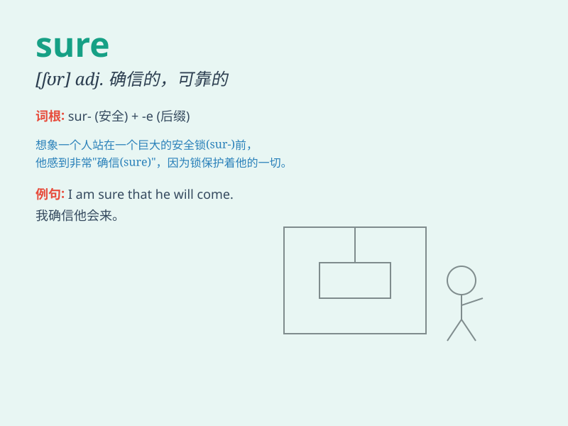

## sure

**英音:** _[ʃɔ:(r)]_ **美音:** _[ʃʊər; ʃʊr]_

**译义:** *adj.对\....有把握,确信某事,稳当的,可靠的adv.的确,当然*

### 短语

+ **be sure of:** _对\...\...有把握_

+ **for sure:** _肯定；毫无疑问_

+ **make sure:** _确保；查明_

+ **sure enough:** _果然；果真_

+ **to be sure:** _诚然；固然_

### 例句

#### 例句1

> **I\'m sure I can do it.**

**中文翻译:** 我确信我能做到。

**单词释义:** 确信

#### 例句2

> **Make sure the door is locked before you leave.**

**中文翻译:** 在你离开之前确保门已锁好。

**单词释义:** 确保

#### 例句3

> **Sure, I\'ll help you.**

**中文翻译:** 当然，我会帮助你。

**单词释义:** 当然

### 背诵小故事

> One day, Tom was lost in a forest. But he was sure he could find the
way out because he had a map. Finally, he did it. Being sure gives you
confidence and leads to success.

**一天，汤姆在森林里迷路了。但他确信自己能找到出路，因为他有一张地图。最后，他做到了。确信能给你信心并带来成功。**

### 图义

