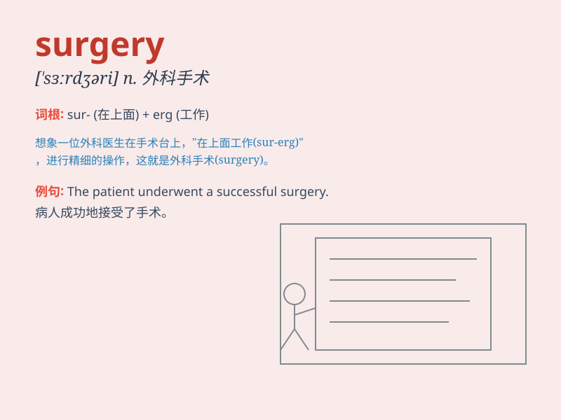

## surgery

**英音:** _[\'sɜːdʒ(ə)rɪ]_ **美音:** _[\'sɝdʒəri]_

**译义:** *n.外科,外科学,手术室,诊疗室*

### 短语

+ **cardiac surgery:** _心脏手术_

+ **plastic surgery:** _整形手术；整形外科_

+ **brain surgery:** _脑部手术_

+ **minor surgery:** _小手术_

+ **surgery department:** _外科部门_

### 例句

#### 例句1

> **She needed surgery to remove the tumor.**

**中文翻译:** 她需要手术来切除肿瘤。

**单词释义:** 外科手术

#### 例句2

> **The hospital has excellent surgery facilities.**

**中文翻译:** 这家医院有出色的外科手术设施。

**单词释义:** 外科；手术

#### 例句3

> **He decided to pursue a career in surgery.**

**中文翻译:** 他决定从事外科职业。

**单词释义:** 外科（学）

### 背诵小故事

> One day, Tom had a serious accident and needed surgery. He was very
scared, but the doctor assured him it would fix his problem. After the
surgery, Tom recovered well. Remember, surgery can save lives!

**有一天，汤姆遭遇了一场严重的事故，需要做手术。他非常害怕，但医生向他保证手术会解决他的问题。手术后，汤姆恢复得很好。记住，手术可以拯救生命！**

### 图义

