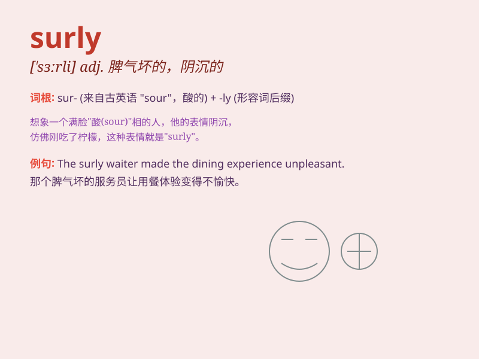

## surly

**英音:** _[ˈsɜːli]_ **美音:** _[ˈsɜːrli]_

**译义:** *adj.粗暴的,乖戾的,阴沉的,无礼的,板面孔的*

### 短语

+ **surly look:** _阴沉的表情_

+ **surly manner:** _粗暴的态度_

+ **surly reply:** _粗暴的回答_

+ **surly behavior:** _粗暴的行为_

+ **surly temper:** _坏脾气_

### 例句

#### 例句1

> **The surly waiter was rude to the customers.**

**中文翻译:** 那个脾气暴躁的服务员对顾客很粗鲁。

**单词释义:** 脾气暴躁的；阴沉的；乖戾的

#### 例句2

> **He gave me a surly look when I asked for help.**

**中文翻译:** 当我请求帮助时，他给了我一个阴沉的表情。

**单词释义:** 阴沉的；不友好的

#### 例句3

> **The surly dog barked fiercely at the strangers.**

**中文翻译:** 那条脾气不好的狗对着陌生人狂吠。

**单词释义:** 脾气不好的；乖戾的

### 背诵小故事

> A surly bear was guarding its cave. No one dared to approach. One
brave adventurer tried to get close, but the bear growled angrily. It
was so surly! Remember, surly means bad-tempered and unfriendly.

**一只脾气暴躁的熊在守护它的洞穴。没人敢靠近。一位勇敢的探险家试图靠近，但熊愤怒地咆哮。它真是脾气坏又不友好！记住，surly
意思是脾气坏的和不友好的。**

### 图义

