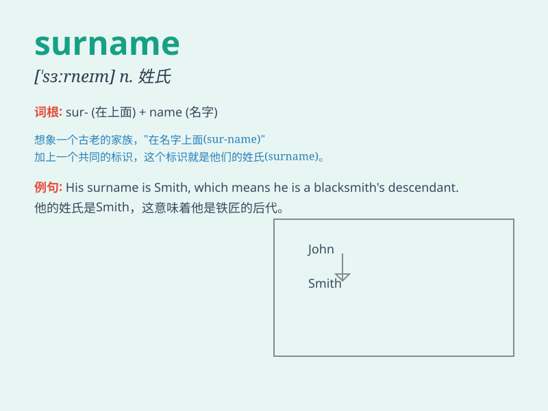

## surname

**英音:** _[\'sɜːneɪm]_ **美音:** _[\'sɝ\'nem]_

**译义:** *n.姓v.用姓称呼*

### 短语

+ **family surname:** _家族姓氏_

+ **last surname:** _最后的姓氏_

+ **common surname:** _常见的姓氏_

+ **original surname:** _原姓氏_

+ **rare surname:** _罕见的姓氏_

### 例句

#### 例句1

> **What is your surname?**

**中文翻译:** 你的姓是什么？

**单词释义:** 姓；姓氏

#### 例句2

> **His surname is Smith.**

**中文翻译:** 他姓史密斯。

**单词释义:** 姓；姓氏

#### 例句3

> **Please write your surname first.**

**中文翻译:** 请先写下你的姓。

**单词释义:** 姓；姓氏

### 背诵小故事

> A young man named Tom was confused when filling a form. He didn\'t
know what \'surname\' meant. His friend told him it was the family name.
So Tom wrote down \'Smith\', which was his family\'s surname.

**一个叫汤姆的年轻人在填写表格时感到困惑。他不知道"surname"是什么意思。他的朋友告诉他这是姓氏。所以汤姆写下了"史密斯"，这是他家的姓氏。**

### 图义

