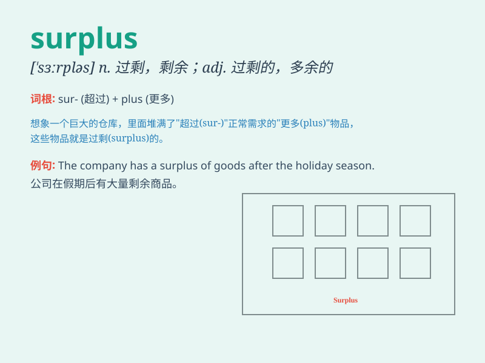

## surplus

**英音:** _[\'sɜːpləs]_ **美音:** _[\'sɝpləs]_

**译义:** *n.剩余,过剩,[会计]盈余adj.过剩的,剩余的vt.转让,卖掉*

### 短语

+ **trade surplus:** _贸易顺差_

+ **budget surplus:** _预算盈余_

+ **surplus value:** _剩余价值_

+ **surplus stock:** _剩余库存_

+ **surplus capacity:** _过剩产能_

### 例句

#### 例句1

> **The company has a large surplus of cash this year.**

**中文翻译:** 这家公司今年有大量的现金盈余。

**单词释义:** 盈余；剩余

#### 例句2

> **The country exports agricultural surpluses to other nations.**

**中文翻译:** 这个国家向其他国家出口农产品剩余。

**单词释义:** 剩余（物）；过剩（量）

#### 例句3

> **We have a surplus of workers and not enough jobs.**

**中文翻译:** 我们有过剩的工人而工作岗位不够。

**单词释义:** 过剩；多余

### 背诵小故事

> A farmer had a surplus of apples. He was worried as they would go
bad. But then he had an idea. He made apple pies and sold them, making
good use of the surplus.

**一位农民有多余的苹果。他很担心它们会坏掉。但随后他有了个主意。他做了苹果派并出售，很好地利用了这些剩余的苹果。**

### 图义

