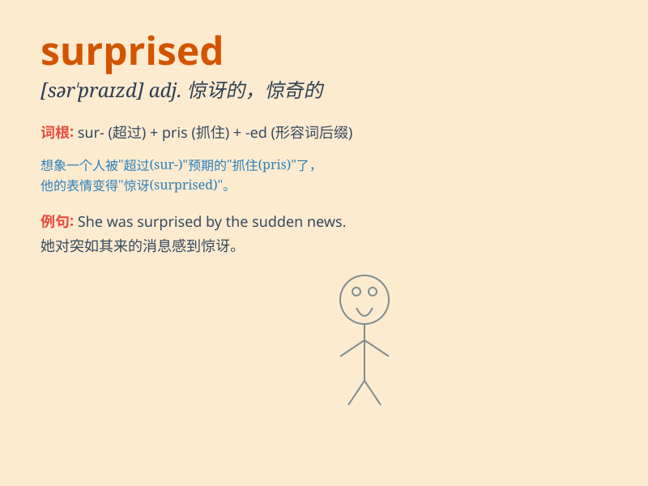

## surprised

**英音:** _[səˈpraɪzd]_ **美音:** _[sərˈpraɪzd]_

**译义:** *adj.感到惊讶的*

### 短语

+ **be surprised at:** _对\...\...感到惊讶_

+ **be surprised to do sth:** _做某事感到惊讶_

+ **come as a surprise:** _令人感到意外_

+ **in surprise:** _惊讶地_

+ **take by surprise:** _使吃惊；突袭_

### 例句

#### 例句1

> **I was surprised to see him there.**

**中文翻译:** 看到他在那里我很惊讶。

**单词释义:** 感到惊讶

#### 例句2

> **She looked surprised when I told her the news.**

**中文翻译:** 当我告诉她这个消息时，她看起来很惊讶。

**单词释义:** 感到惊讶的

#### 例句3

> **We were all surprised at his sudden decision.**

**中文翻译:** 我们都对他突然的决定感到惊讶。

**单词释义:** 感到惊讶

### 背诵小故事

> One day, Tom came home earlier than usual. His parents were surprised
because they didn\'t expect him. They thought he was still at school.
This unexpected event made them feel surprised.

**一天，汤姆比平常回家早。他的父母很惊讶，因为他们没想到他会回来。他们以为他还在学校。这个意外事件让他们感到惊讶。**

### 图义

