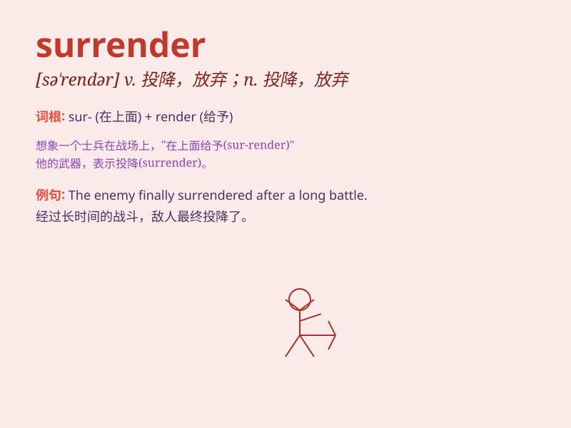

## surrender

**英音:** _[sə\'rendə]_ **美音:** _[sə\'rɛndɚ]_

**译义:** *vt.交出,放弃,使投降,听任vi.投降,自首n.交出,放弃,投降
投降算了*

### 短语

+ **surrender oneself:** _自首；投降；屈服_

+ **surrender to:** _向\...\...投降；屈服于\...\..._

+ **unconditional surrender:** _无条件投降_

+ **surrender sth. to sb.:** _把某物交给某人_

+ **voluntary surrender:** _自愿投降_

### 例句

#### 例句1

> **The enemy was forced to surrender.**

**中文翻译:** 敌人被迫投降。

**单词释义:** 投降

#### 例句2

> **He surrendered his passport at the border.**

**中文翻译:** 他在边境交出了护照。

**单词释义:** 交出

#### 例句3

> **She surrendered herself to despair.**

**中文翻译:** 她陷入绝望之中。

**单词释义:** 陷入；听任

### 背诵小故事

> A brave soldier was in a fierce battle. Surrounded by enemies, he had
no choice but to surrender. He laid down his weapon, showing that he
gave up the fight.

**一位勇敢的士兵身处激烈的战斗中。被敌人包围，他别无选择只能投降。他放下武器，表明他放弃战斗。**

### 图义

