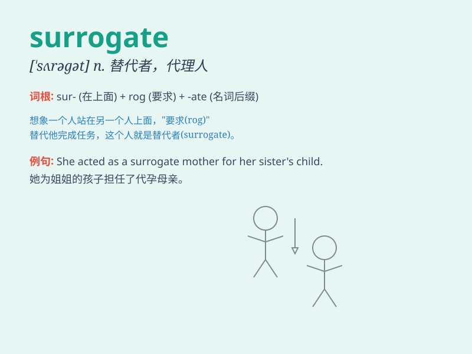

## surrogate

**英音:** _[\'sʌrəgət]_ **美音:** _[ˈsərəgɪt; ˈsərəˌget;
(for v.,) ˈsərəˌget]_

**译义:** *n.代理,代用品,代理人vt.使代理,使代替*

### 短语

+ **surrogate mother:** _代孕母亲_

+ **surrogate marker:** _替代标志物_

+ **surrogate endpoint:** _替代终点_

+ **surrogate advertising:** _隐性广告_

+ **surrogate decision maker:** _代理决策者_

### 例句

#### 例句1

> **The surrogate mother carried the baby for the infertile
couple.**

**中文翻译:** 这位代孕母亲为这对不育夫妇孕育了孩子。

**单词释义:** 代孕者

#### 例句2

> **He used a surrogate to sign the important document for him.**

**中文翻译:** 他让一个代理人替他签署这份重要文件。

**单词释义:** 代理人

#### 例句3

> **The surrogate key was used to identify the records in the
database.**

**中文翻译:** 在数据库中，代理键被用于标识记录。

**单词释义:** 代理主键；替代键

### 背诵小故事

> A couple couldn\'t have a baby. So they found a surrogate mother.
This woman agreed to carry and give birth to their child. \'Surrogate\'
means a substitute or stand-in.

**一对夫妇无法生育。于是他们找了一位代孕母亲。这位女士同意为他们怀胎并生下孩子。'surrogate'意思是替代品或替身。**

### 图义

