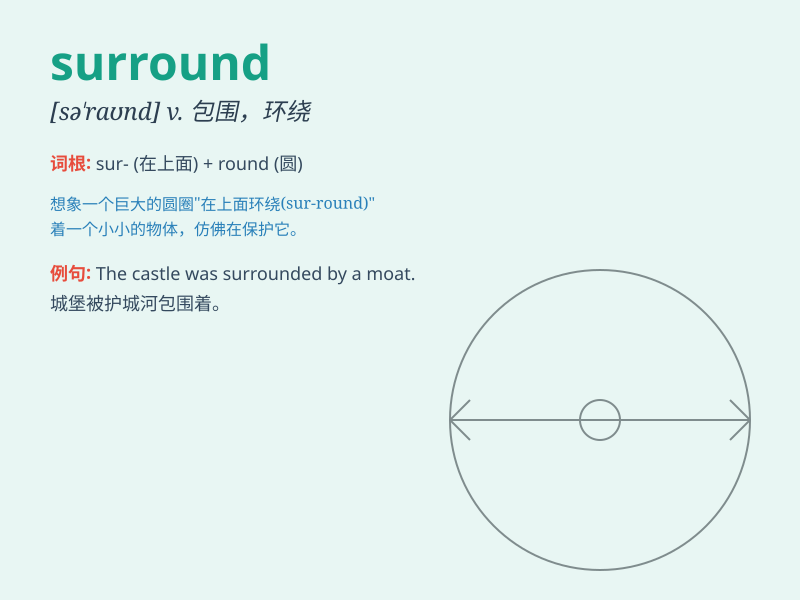

## surround

**英音:** _[sə\'raʊnd]_ **美音:** _[sə\'raʊnd]_

**译义:** *vt.包围,环境v.围绕*

### 短语

+ **surround oneself with:** _和...在一起；与...为伍_

+ **be surrounded by:** _被...环绕；被...包围_

+ **surround sound:** _环绕立体声_

+ **surround environment:** _周边环境_

+ **surround lighting:** _环绕照明_

### 例句

#### 例句1

> **The house is surrounded by a high fence.**

**中文翻译:** 这座房子被高高的栅栏围着。

**单词释义:** 被\...\...环绕；围绕

#### 例句2

> **The crowd surrounded the movie star.**

**中文翻译:** 人群围住了这位电影明星。

**单词释义:** 包围；围住

#### 例句3

> **The beautiful scenery surrounds the small town.**

**中文翻译:** 美丽的景色环绕着这个小镇。

**单词释义:** 环绕；围绕

### 背诵小故事

> A brave knight was in a forest. Suddenly, he found himself surrounded
by fierce wolves. But he stayed calm and fought back. \'Surround\' means
to be all around something or someone.

**一位勇敢的骑士在森林里。突然，他发现自己被凶猛的狼包围了。但他保持冷静并反击。'surround'意思是围绕某物或某人。**

### 图义

