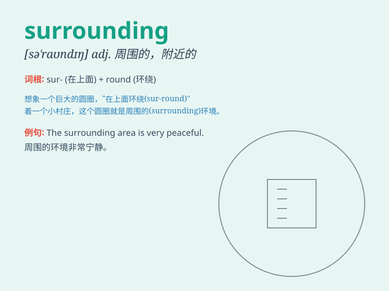

## surrounding

**英音:** _[sə\'raʊndɪŋ]_ **美音:** _[sə\'raʊndɪŋ]_

**译义:** *n.围绕物,环境adj.周围的*

### 短语

+ **surrounding area:** _周边地区_

+ **surrounding environment:** _周围环境_

+ **surrounding landscape:** _周边景观_

+ **surrounding circumstances:** _周围情况；环境_

+ **surrounding towns:** _周边城镇_

### 例句

#### 例句1

> **The house is in beautiful surrounding countryside.**

**中文翻译:** 这座房子位于美丽的乡村周边。

**单词释义:** 周围的；周边的

#### 例句2

> **The police are questioning people in the surrounding area.**

**中文翻译:** 警察正在询问周边地区的人们。

**单词释义:** 附近的；周围的

#### 例句3

> **The surrounding environment is very quiet.**

**中文翻译:** 周围的环境非常安静。

**单词释义:** 周围的；四周的

### 背诵小故事

> A brave explorer was lost in a forest. He felt scared as unknown
sounds surrounded him. But he stayed calm and found his way out by
observing the surrounding trees and paths.

**一位勇敢的探险家在森林里迷路了。未知的声音环绕着他，他感到害怕。但他保持冷静，通过观察周围的树木和路径找到了出路。**

### 图义

