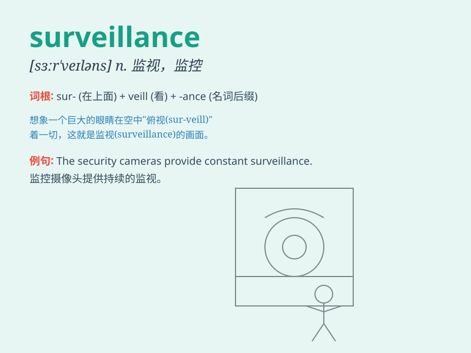

## surveillance

**英音:** _[sə\'veɪl(ə)ns; -\'veɪəns]_ **美音:**
_[sɝ\'veləns]_

**译义:** *n.监视,监督*

### 短语

+ **surveillance camera:** _监控摄像头_

+ **surveillance system:** _监视系统_

+ **electronic surveillance:** _电子监视_

+ **close surveillance:** _严密监视_

+ **constant surveillance:** _持续监视_

### 例句

#### 例句1

> **The police kept the suspect under surveillance.**

**中文翻译:** 警方对嫌疑人进行了监视。

**单词释义:** 监视；监督

#### 例句2

> **Surveillance cameras are installed in the shopping mall for
security.**

**中文翻译:** 为了安全，购物中心安装了监控摄像头。

**单词释义:** 监控

#### 例句3

> **The company加强了对员工电子邮件的surveillance to prevent data
leaks.**

**中文翻译:** 公司加强了对员工电子邮件的监视以防止数据泄露。

**单词释义:** 监视；监察

### 背诵小故事

> A spy was assigned the task of surveillance. He had to secretly watch
and monitor the movements of a criminal gang. Every day, he hid and
observed carefully. Finally, his surveillance helped catch the
criminals.

**一名间谍被指派了监视的任务。他必须秘密观察和监控一个犯罪团伙的行动。每天，他都隐藏起来仔细观察。最终，他的监视帮助抓住了罪犯。**

### 图义

