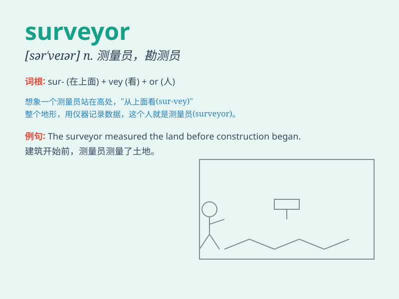

## surveyor

**英音:** _[sə\'veɪə]_ **美音:** _[sɚ\'veɚ]_

**译义:** *n.测量员,检查员*

### 短语

+ **land surveyor:** _土地测量员_

+ **quantity surveyor:** _工料测量师_

+ **building surveyor:** _建筑测量师_

+ **surveyor general:** _测量总监_

+ **mining surveyor:** _采矿测量员_

### 例句

#### 例句1

> **The surveyor measured the land accurately.**

**中文翻译:** 测量员精确地测量了这块土地。

**单词释义:** 测量员

#### 例句2

> **The surveyor reported that the building was structurally
sound.**

**中文翻译:** 测量员报告说这座建筑结构完好。

**单词释义:** 测量员

#### 例句3

> **We hired a surveyor to assess the value of the property.**

**中文翻译:** 我们雇了一名测量员来评估这处房产的价值。

**单词释义:** 测量员

### 背诵小故事

> A young man named Tom dreamed of becoming a surveyor. One day, he
climbed mountains and crossed rivers with his tools to measure and map
the land. Finally, his hard work paid off and he became a famous
surveyor.

**一个叫汤姆的年轻人梦想成为一名测量员。有一天，他带着工具爬山过河去测量和绘制土地。最终，他的努力得到了回报，他成为了一位著名的测量员。**

### 图义

