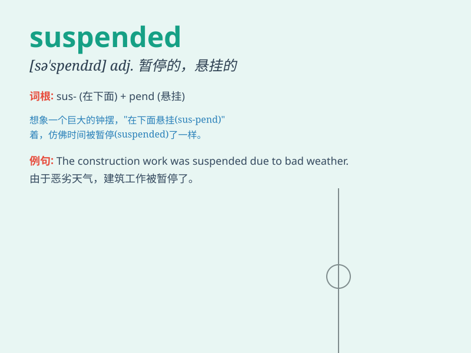

## suspended

**英音:** _[sə\'spendɪd]_ **美音:** _[sə\'spɛndɪd]_

**译义:** *adj.
暂停的；中止的；悬而未决的；被暂停职务的（常用作后置定语）*

### 短语

+ **suspended animation:** _假死；停滞_

+ **suspended sentence:** _缓刑_

+ **suspended coffee:** _待用咖啡_

+ **suspended particles:** _悬浮粒子_

+ **suspended state:** _悬浮状态；挂起状态_

### 例句

#### 例句1

> **The student was suspended from school for bad behavior.**

**中文翻译:** 这名学生因不良行为被学校停课。

**单词释义:** 暂停；停学

#### 例句2

> **The project was suspended due to lack of funds.**

**中文翻译:** 由于缺乏资金，该项目被暂停了。

**单词释义:** 暂停；中止

#### 例句3

> **The chandelier was suspended from the ceiling.**

**中文翻译:** 吊灯从天花板上悬挂下来。

**单词释义:** 悬挂

### 背诵小故事

> A little monkey was playing on a rope. But it was too naughty and got
suspended in the air. When people found it, they quickly helped it down.
\'Suspended\' means hanging in the air or stopped for a time.

**一只小猴子在绳子上玩耍。但它太顽皮了，被悬在了空中。当人们发现时，迅速把它救了下来。'suspended'意思是悬在空中或暂停一段时间。**

### 图义

