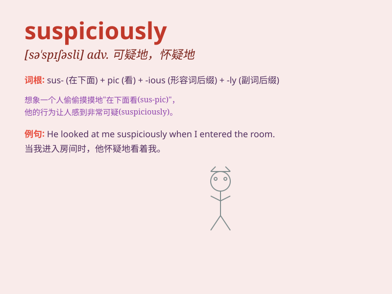

## suspiciously

**英音:** _[səˈspɪʃəsli]_ **美音:** _[səˈspɪʃəsli]_

**译义:** *adv.猜疑着,怀疑着*

### 短语

+ **suspiciously alike:** _出奇地相似_

+ **suspiciously quiet:** _异常安静_

+ **suspiciously low:** _可疑地低_

+ **suspiciously early:** _过早得令人怀疑_

+ **suspiciously often:** _频繁得可疑_

### 例句

#### 例句1

> **He looked at me suspiciously when I entered the room.**

**中文翻译:** 当我进入房间时，他怀疑地看着我。

**单词释义:** 怀疑地

#### 例句2

> **The package was delivered suspiciously late.**

**中文翻译:** 这个包裹可疑地很晚才送达。

**单词释义:** 可疑地

#### 例句3

> **She eyed the stranger suspiciously as he walked by.**

**中文翻译:** 当那个陌生人走过时，她怀疑地盯着他。

**单词释义:** 怀疑地

### 背诵小故事

> A detective was observing a man suspiciously. The man was behaving
strangely, looking around nervously and walking suspiciously. The
detective knew something was wrong.

**一位侦探正怀疑地观察着一个男人。这个男人行为古怪，紧张地四处张望，走路的样子也很可疑。侦探知道有问题。**

### 图义

