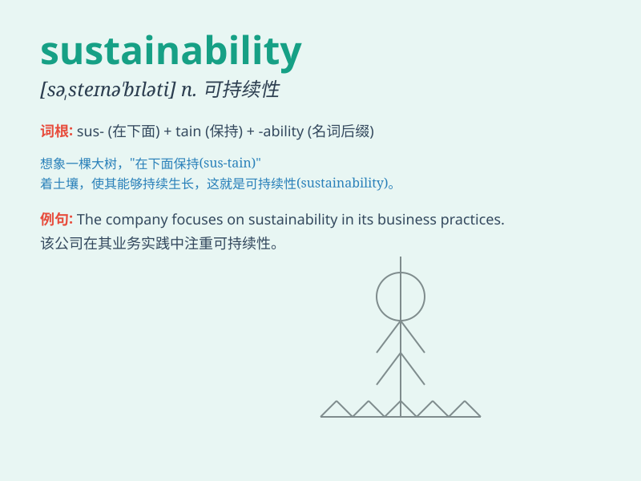

## sustainability

**英音:** _[səˌsteɪnəˈbɪləti]_ **美音:**
_[səˌsteɪnəˈbɪləti]_

**译义:** *n. 可持续性；可持续发展；可持续能力*

### 短语

+ **environmental sustainability:** _环境可持续性_

+ **sustainable development:** _可持续发展_

+ **corporate sustainability:** _企业可持续性_

+ **energy sustainability:** _能源可持续性_

+ **agricultural sustainability:** _农业可持续性_

### 例句

#### 例句1

> **The company is committed to achieving sustainability in its
business practices.**

**中文翻译:** 这家公司致力于在其商业实践中实现可持续性。

**单词释义:** 可持续性

#### 例句2

> **Sustainability has become a key concern for many cities around
the world.**

**中文翻译:** 可持续性已成为世界各地许多城市的关键关注点。

**单词释义:** 可持续性

#### 例句3

> **We need to promote sustainability to protect our planet for
future generations.**

**中文翻译:** 我们需要促进可持续性，为子孙后代保护我们的星球。

**单词释义:** 可持续性

### 背诵小故事

> A small village was facing many problems. But a wise man came and
taught them how to sustain their resources for the long term. This
ability to keep going and not run out was called sustainability.

**一个小村庄面临着许多问题。但一位智者前来教导他们如何长期维持资源。这种能够持续下去且不会耗尽的能力被称为可持续性。**

### 图义

