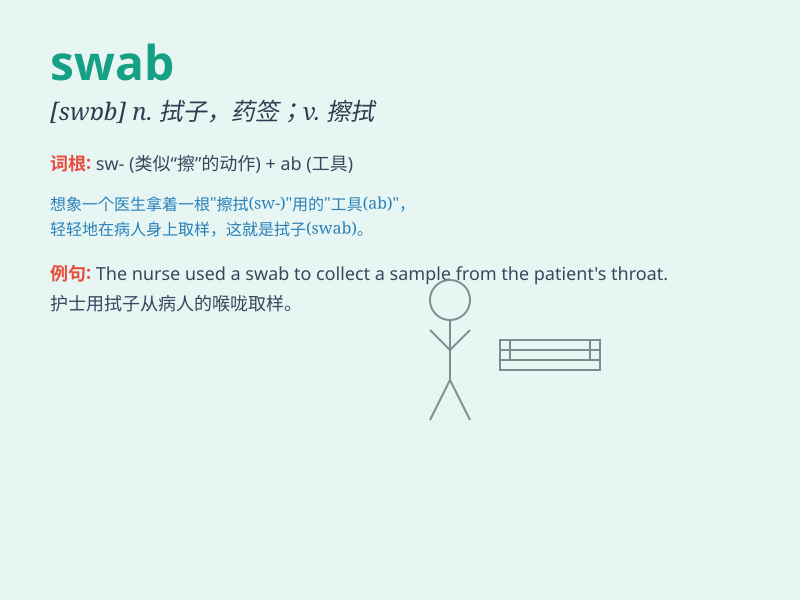

## swab

**英音:** _[swɒb]_ **美音:** _[swɑb]_

**译义:** *n.拖把,药签vt.拭抹,擦洗*

### 短语

+ **swab test:** _拭子检测_

+ **swab down:** _擦洗；擦拭_

+ **cotton swab:** _棉签_

+ **swab out:** _把\...擦净_

+ **sterile swab:** _无菌拭子_

### 例句

#### 例句1

> **The nurse used a swab to collect a sample from the patient\'s
throat.**

**中文翻译:** 护士用拭子从病人的喉咙采集样本。

**单词释义:** 拭子；棉签

#### 例句2

> **He swabbed the deck with a mop.**

**中文翻译:** 他用拖把擦洗甲板。

**单词释义:** 用拭子（或布等）擦洗

#### 例句3

> **She swabbed the cut with alcohol.**

**中文翻译:** 她用酒精擦拭伤口。

**单词释义:** 用（棉花、纱布等）擦拭

### 背诵小故事

> A doctor needed to collect a sample from a patient. So, he used a
swab to gently take the needed material. The swab was like a magic stick
that helped find out the problem.

**一位医生需要从病人身上采集样本。于是，他用拭子轻轻地获取所需的物质。这个拭子就像一根魔法棒，帮助找出问题。**

### 图义

