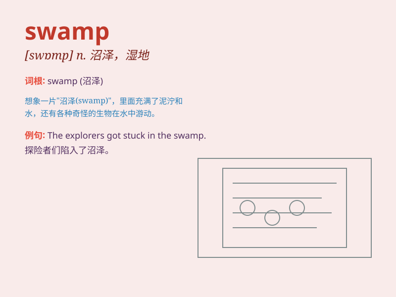

## swamp

**英音:** _[swɒmp]_ **美音:** _[swɑmp]_

**译义:** *n.沼泽,湿地,煤层聚水v.陷入沼泽,淹没,覆没*

### 短语

+ **swamp area:** _沼泽地区_

+ **swamp fever:** _疟疾_

+ **swamp land:** _沼泽地_

+ **swamp plant:** _沼泽植物_

+ **swamp out:** _使陷入沼泽；使淹没_

### 例句

#### 例句1

> **The heavy rain turned the field into a swamp.**

**中文翻译:** 这场大雨把田野变成了一片沼泽。

**单词释义:** 沼泽；湿地

#### 例句2

> **I was almost swallowed up by the swamp of work.**

**中文翻译:** 我几乎被工作的重负压垮了。

**单词释义:** 大量；许多

#### 例句3

> **The small boat got stuck in the swamp.**

**中文翻译:** 小船陷在了沼泽里。

**单词释义:** 沼泽；泥潭

### 背诵小故事

> A brave explorer was lost in a forest. Suddenly, he found himself in
a swamp. The water was deep and the ground was soft. He struggled hard
to get out. Remember, swamp means a wetland area full of water and mud.

**一位勇敢的探险家在森林中迷路了。突然，他发现自己身处一片沼泽。水很深，地面很软。他艰难地挣扎着出去。记住，swamp
指的是充满水和泥的湿地。**

### 图义

