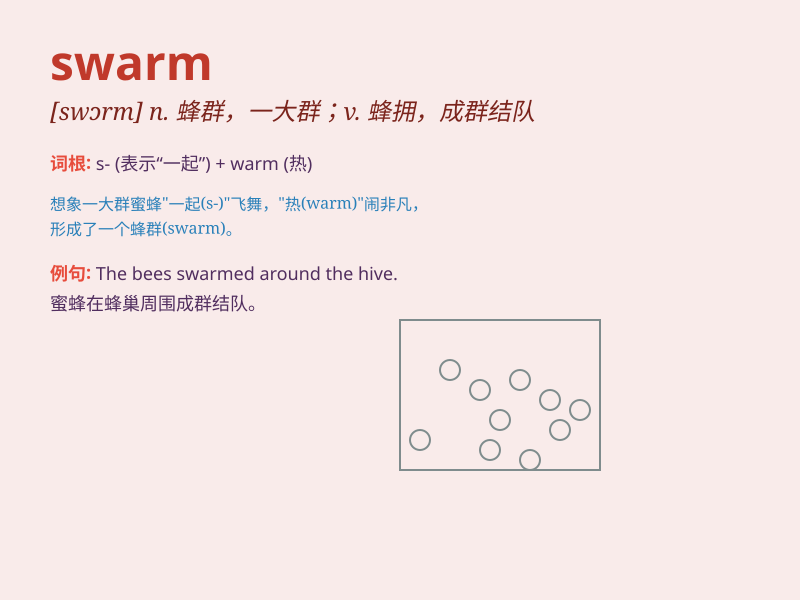

## swarm

**英音:** _[swɔːm]_ **美音:** _[swɔrm]_

**译义:** *n.蜂群,一大群v.涌往,挤满,密集,成群浮游,云集*

### 短语

+ **a swarm of bees:** _一群蜜蜂_

+ **swarm into:** _涌入_

+ **swarm with:** _挤满；充满_

+ **in swarms:** _成群地_

+ **swarm out:** _成群出动_

### 例句

#### 例句1

> **A swarm of bees flew out of the hive.**

**中文翻译:** 一群蜜蜂从蜂巢里飞了出来。

**单词释义:** 一群（指大量的昆虫等聚集在一起）

#### 例句2

> **The beach was swarming with tourists.**

**中文翻译:** 海滩上挤满了游客。

**单词释义:** 挤满；充满

#### 例句3

> **The protesters swarmed into the square.**

**中文翻译:** 抗议者涌入了广场。

**单词释义:** 涌入；蜂拥

### 背诵小故事

>
想象一下，在一个美丽的花园里，突然出现了一大群蜜蜂。它们密密麻麻，像一片黑云一样飞过来。这些蜜蜂就形成了一个\'swarm\'（蜂群）。

**想象在花园中突然出现一大群像黑云般飞来的蜜蜂，它们形成的群体就是\'swarm\'（蜂群）**

### 图义

