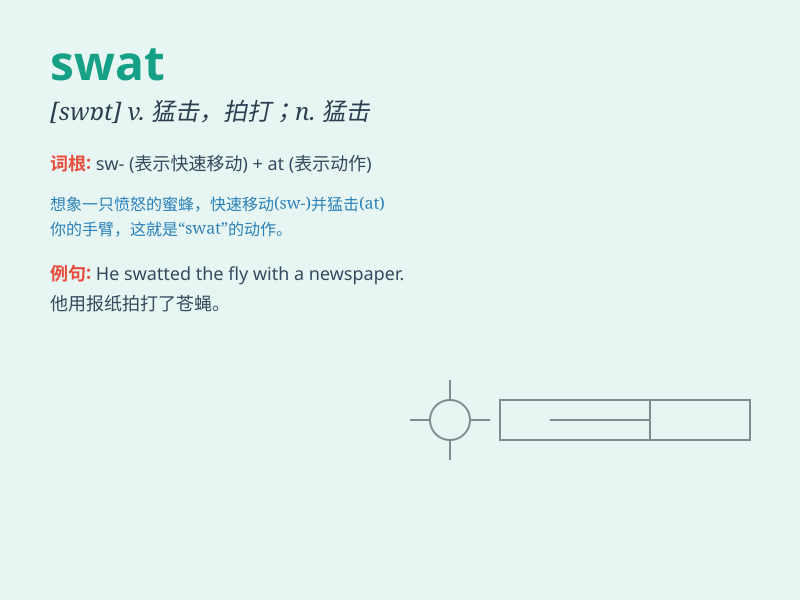

## swat

**英音:** _[swɒt]_ **美音:** _[swɑt]_

**译义:** *vt.猛击,用力打下去,重拍n.用劲打击,长打,全垒打 [军]
Special Warfare Armored Transporter,特种战争装甲运输车*

### 短语

+ **swat team:** _特警队_

+ **swat away:** _拍走；赶走_

+ **swat insects:** _拍打昆虫_

+ **swat at something:** _猛击某物_

+ **give a swat:** _给一记拍打_

### 例句

#### 例句1

> **The fly was annoying, so I tried to swat it.**

**中文翻译:** 这只苍蝇很烦人，所以我试图拍打它。

**单词释义:** 拍打

#### 例句2

> **The police officer had to swat the thief\'s hand away to prevent
him from escaping.**

**中文翻译:** 警察不得不拍开小偷的手以防他逃跑。

**单词释义:** 用力拍打

#### 例句3

> **She swatted the ball over the net with great force.**

**中文翻译:** 她用力把球打过网。

**单词释义:** 猛击

### 背诵小故事

> A fly was buzzing around. The angry man took a swatter and SWAT! He
hit the fly hard. It shows the forceful action of hitting something
quickly and sharply, like swatting an insect.

**一只苍蝇嗡嗡乱飞。愤怒的男人拿起苍蝇拍，啪！他用力地打苍蝇。这展示了快速、有力地击打某物的动作，就像拍打昆虫一样。**

### 图义

