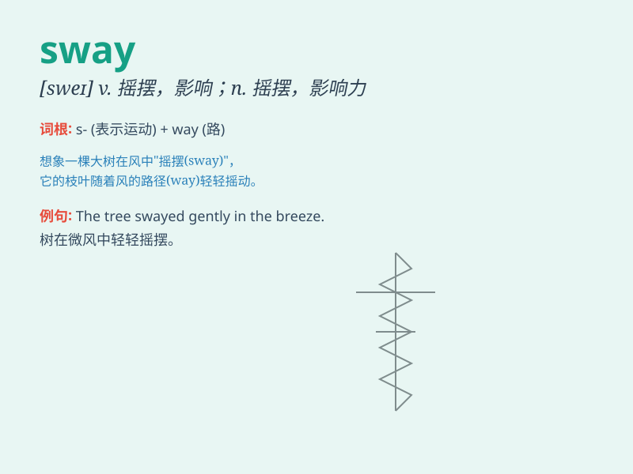

## sway

**英音:** _[sweɪ]_ **美音:** _[swe]_

**译义:** *v.摇摆,摇动*

### 短语

+ **sway back and forth:** _来回摇摆_

+ **sway one\'s opinion:** _动摇某人的意见_

+ **sway the crowd:** _左右群众_

+ **under the sway of:** _在\...\...的支配下_

+ **sway gently:** _轻轻摇晃_

### 例句

#### 例句1

> **The branches of the tree swayed gently in the wind.**

**中文翻译:** 树枝在风中轻轻摇曳。

**单词释义:** 摇摆，摇晃

#### 例句2

> **She was swayed by his persuasive argument.**

**中文翻译:** 她被他有说服力的论点说服了。

**单词释义:** 影响，左右

#### 例句3

> **The crowd swayed back and forth as they sang.**

**中文翻译:** 人群在唱歌时前后晃动。

**单词释义:** 晃动，摇摆

### 背诵小故事

> A strong wind came and started to sway the big tree. The branches
were moving left and right. It looked like the tree was dancing in the
wind. Remember, when something moves like that, it\'s swaying.

**一阵强风刮来，开始摇晃那棵大树。树枝左右摆动。看起来这棵树像是在风中跳舞。记住，当某物像这样移动时，就是在
sway（摇晃）。**

### 图义

