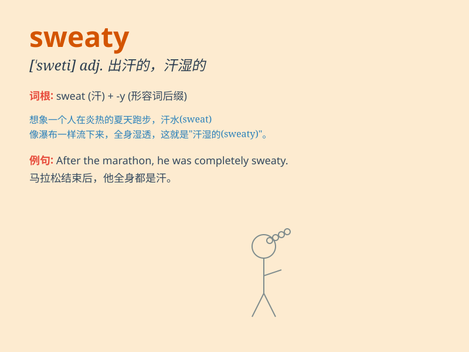

## sweaty

**英音:** _[\'swetɪ]_ **美音:** _[\'swɛti]_

**译义:** *adj.出汗的,吃力的*

### 短语

+ **sweaty palms:** _手心出汗_

+ **sweaty workout:** _出汗的锻炼_

+ **sweaty clothes:** _汗湿的衣服_

+ **sweaty face:** _满是汗水的脸_

+ **sweaty job:** _费力出汗的工作_

### 例句

#### 例句1

> **After the intense workout, he was sweaty and exhausted.**

**中文翻译:** 在剧烈的锻炼之后，他满身是汗，精疲力竭。

**单词释义:** 满身是汗的

#### 例句2

> **The summer day was so hot that everyone became sweaty within
minutes.**

**中文翻译:** 夏日天气太热了，几分钟内每个人都汗流浃背。

**单词释义:** 汗流浃背的

#### 例句3

> **She wiped her sweaty forehead with a handkerchief.**

**中文翻译:** 她用手帕擦了擦满是汗水的额头。

**单词释义:** 满是汗水的

### 背诵小故事

> One hot summer day, I went for a run and came back very sweaty. My
shirt was soaked, and my face was dripping with perspiration. \'Sweaty\'
means covered with or producing sweat.

**在一个炎热的夏日，我去跑步，回来时浑身是汗。我的衬衫湿透了，脸上汗水直淌。\'sweaty\'意思是满是汗的或出汗的。**

### 图义

