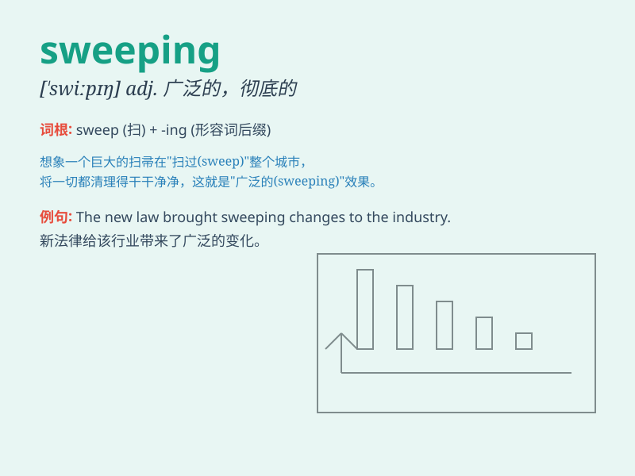

## sweeping

**英音:** _[\'swiːpɪŋ]_ **美音:** _[\'swipɪŋ]_

**译义:** *n.扫除,垃圾adj.扫荡的,彻底的,广泛的,规模大的*

### 短语

+ **sweeping generalization:** _笼统的概括_

+ **sweeping statement:** _一概而论的说法_

+ **sweeping reform:** _全面改革_

+ **sweeping victory:** _压倒性胜利_

+ **sweeping curve:** _大弧线_

### 例句

#### 例句1

> **The sweeping reforms will have a profound impact on the
country\'s economy.**

**中文翻译:** 大规模的改革将对该国的经济产生深远的影响。

**单词释义:** 大规模的；广泛的

#### 例句2

> **She made a sweeping gesture with her arm.**

**中文翻译:** 她用胳膊做了一个大幅度的动作。

**单词释义:** 大幅度的；一挥而就的

#### 例句3

> **The sweeping wind blew away the fallen leaves.**

**中文翻译:** 狂风把落叶吹走了。

**单词释义:** 猛烈的；强劲的

### 背诵小故事

> A brave knight was on a mission. He used a sweeping movement with his
sword to clear the path filled with obstacles. The wide and forceful
motion was like the meaning of \'sweeping\'.

**一位勇敢的骑士在执行任务。他用剑做出了一个大幅度的挥扫动作来清除满是障碍的道路。这种宽广而有力的动作就像'sweeping'这个词的意思。**

### 图义

