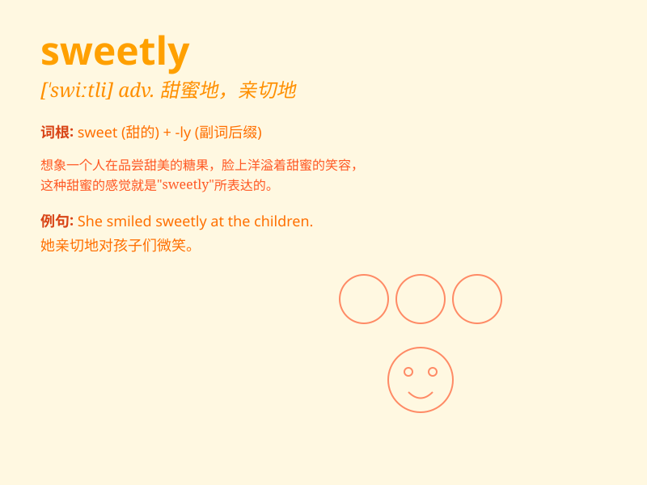

## sweetly

**英音:** _[ˈswiːtli]_ **美音:** _[ˈswiːtli]_

**译义:** *adv.甜地,香郁地,含糖地*

### 短语

+ **sweetly smiling:** _甜甜地微笑_

+ **sweetly singing:** _甜美地歌唱_

+ **sweetly sleeping:** _香甜地睡着_

+ **sweetly speaking:** _亲切地说话_

+ **sweetly dreaming:** _甜甜地做梦_

### 例句

#### 例句1

> **She sang sweetly at the concert.**

**中文翻译:** 她在音乐会上唱得甜美动听。

**单词释义:** 甜美地

#### 例句2

> **The flowers smelled sweetly.**

**中文翻译:** 这些花闻起来很香。

**单词释义:** 香甜地

#### 例句3

> **He smiled sweetly at her.**

**中文翻译:** 他对她甜甜地笑了。

**单词释义:** 甜蜜地

### 背诵小故事

> A little girl was singing sweetly in the garden. The birds stopped
chirping to listen. Her voice was as pleasant as the smell of flowers.
Everyone was charmed by her sweetly sung song.

**一个小女孩在花园里甜美地唱歌。鸟儿们停止了鸣叫来倾听。她的声音像花香一样令人愉快。每个人都被她甜美的歌声所吸引。**

### 图义

