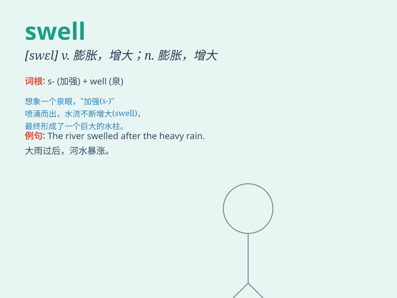

## swell

**英音:** _[swel]_ **美音:** _[swɛl]_

**译义:** *v.(使)膨胀,增大*

### 短语

+ **swell up:** _肿起来；膨胀_

+ **swell with:** _充满；因\...而膨胀_

+ **heart swell:** _心潮澎湃_

+ **swell out:** _凸出；鼓出_

+ **swell the ranks:** _壮大队伍_

### 例句

#### 例句1

> **The waves were swelling and crashing against the shore.**

**中文翻译:** 海浪在不断涌起并拍打着海岸。

**单词释义:** （使）增强，（使）上涨

#### 例句2

> **Her ankle was swelling up after the fall.**

**中文翻译:** 她摔倒后脚踝肿了起来。

**单词释义:** 肿胀，膨胀

#### 例句3

> **The music made her heart swell with joy.**

**中文翻译:** 音乐让她的心充满了喜悦。

**单词释义:** （使）充满（感情）

### 背诵小故事

> One day, I went to the beach. The waves were huge and they would
swell up and crash onto the shore. It was an amazing sight. The
word\'swell\' means to increase in size or volume, just like those
growing waves.

**有一天，我去了海滩。海浪非常大，它们会涌起然后拍打在岸边。这是一个惊人的景象。单词\'swell\'意思是（体积或数量）增大，就像那些不断涌起的海浪。**

### 图义

