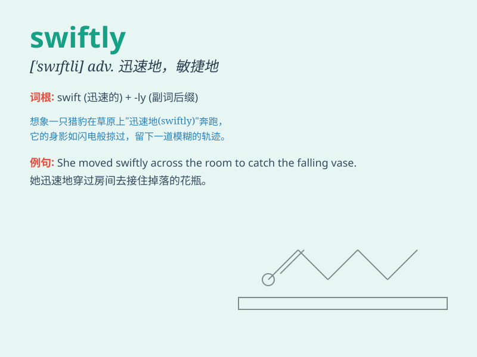

## swiftly

**英音:** _[ˈswɪftli]_ **美音:** _[ˈswɪftlɪ]_

**译义:** *adv.很快地,即刻*

### 短语

+ **move swiftly:** _迅速移动_

+ **react swiftly:** _迅速反应_

+ **turn swiftly:** _迅速转身_

+ **answer swiftly:** _迅速回答_

+ **act swiftly:** _迅速行动_

### 例句

#### 例句1

> **The wind blew swiftly across the field.**

**中文翻译:** 风迅速地吹过田野。

**单词释义:** 迅速地

#### 例句2

> **She moved swiftly to catch the falling vase.**

**中文翻译:** 她迅速移动去接住掉落的花瓶。

**单词释义:** 迅速地

#### 例句3

> **The news spread swiftly through the town.**

**中文翻译:** 这个消息迅速在镇上传播开来。

**单词释义:** 迅速地

### 背诵小故事

> A little rabbit was running swiftly in the forest to escape from a
hungry wolf. It moved so fast that it soon found a safe cave. The
rabbit\'s swift movement saved its life.

**一只小兔子在森林里飞快地跑着躲避一只饥饿的狼。它跑得如此之快，很快就找到了一个安全的洞穴。兔子的快速移动救了它的命。**

### 图义

