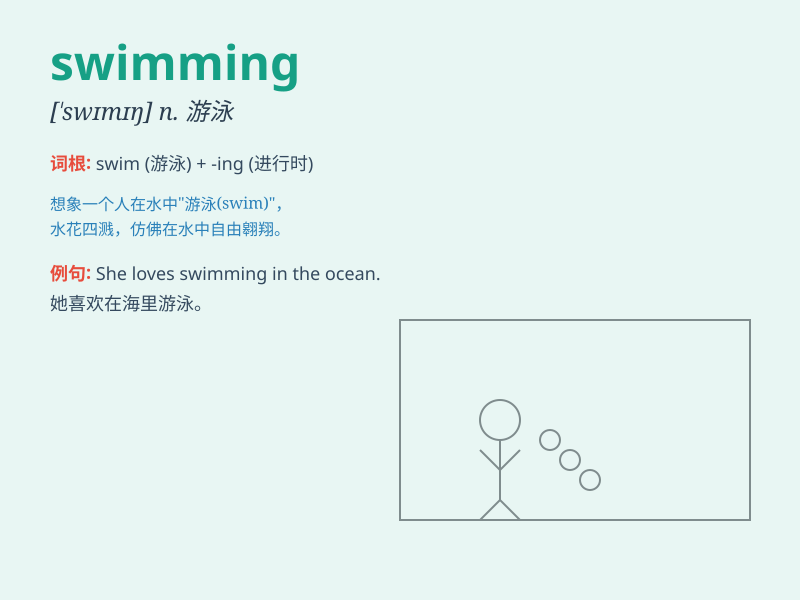

## swimming

**英音:** _[\'swɪmɪŋ]_ **美音:** _[\'swɪmɪŋ]_

**译义:** *n.游水,目眩adj.游泳(者)的,游泳(者)用的,会游泳的*

### 短语

+ **swimming pool:** _游泳池_

+ **swimming suit:** _泳衣_

+ **swimming cap:** _泳帽_

+ **go swimming:** _去游泳_

+ **swimming lesson:** _游泳课_

### 例句

#### 例句1

> **I enjoy swimming in the pool on hot summer days.**

**中文翻译:** 在炎热的夏天，我喜欢在游泳池里游泳。

**单词释义:** 游泳（动名词，指游泳这项活动）

#### 例句2

> **Swimming is a great form of exercise.**

**中文翻译:** 游泳是一种很棒的锻炼形式。

**单词释义:** 游泳（动名词，强调游泳这种运动）

#### 例句3

> **She is good at swimming.**

**中文翻译:** 她擅长游泳。

**单词释义:** 游泳（动名词，作为 be good at 的宾语）

### 背诵小故事

> One hot summer day, Tom felt very bored. So he decided to go swimming
in the cool river. He put on his swimming trunks and jumped into the
water. He had a great time swimming and forgot all his troubles.

**在一个炎热的夏日，汤姆感到非常无聊。于是他决定去凉爽的河里游泳。他穿上泳裤跳进水里。他游泳游得很开心，忘记了所有的烦恼。**

### 图义

