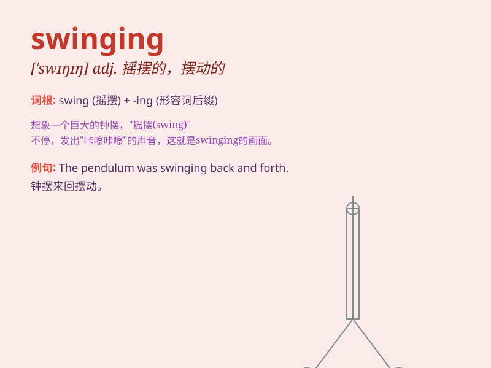

## swinging

**英音:** _[ˈswɪŋɪŋ]_ **美音:** _[ˈswɪŋɪŋ]_

**译义:**
*adj.活跃而时髦的；摆动的；纵身跃出的；（性活动）乱交的；v.摆动；（使）摇摆；摇荡；纵身跃出；（使）旋转；（使）突然转向*

### 短语

+ **swinging party:** _热闹的聚会_

+ **swinging door:** _双开式弹簧门_

+ **swinging lifestyle:** _放纵的生活方式_

+ **swinging motion:** _摆动运动_

+ **swinging bridge:** _吊桥_

### 例句

#### 例句1

> **The children were swinging on the playground swings.**

**中文翻译:** 孩子们正在操场上荡秋千。

**单词释义:** 摇摆，荡秋千

#### 例句2

> **The swinging door almost hit me as I walked by.**

**中文翻译:** 当我走过时，那扇摆动的门差点撞到我。

**单词释义:** 摆动，摇晃

#### 例句3

> **The music at the party had a swinging beat that made everyone
dance.**

**中文翻译:** 派对上的音乐有欢快的节奏，让每个人都跳起舞来。

**单词释义:** 活跃的，有活力的

### 背诵小故事

> One day, I went to the park and saw a monkey swinging happily on the
branches. Its swinging movements were so flexible and interesting. It
made me remember the word \'swinging\' which means moving back and forth
through the air.

**有一天，我去公园看到一只猴子在树枝上欢快地荡来荡去。它荡秋千的动作是如此灵活和有趣。这让我记住了'swinging'这个词，意思是在空中来回摆动。**

### 图义

