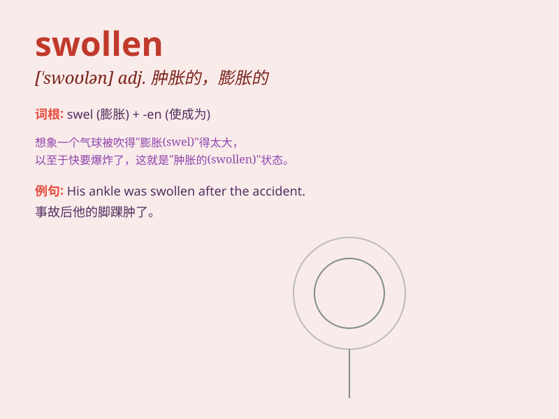

## swollen

**英音:** _[\'swəʊlən]_ **美音:** _[\'swolən]_

**译义:** *adj.肿胀的*

### 短语

+ **swollen ankle:** _肿胀的脚踝_

+ **swollen eyes:** _肿胀的眼睛_

+ **swollen glands:** _肿胀的腺体_

+ **swollen river:** _泛滥的河流_

+ **swollen face:** _肿胀的脸_

### 例句

#### 例句1

> **Her ankle was swollen after the fall.**

**中文翻译:** 她摔倒后脚踝肿了。

**单词释义:** 肿胀的

#### 例句2

> **The river was swollen with rainwater.**

**中文翻译:** 这条河因雨水而涨水了。

**单词释义:** 涨满的

#### 例句3

> **His eyes were swollen from crying.**

**中文翻译:** 他的眼睛因哭泣而肿了。

**单词释义:** 肿起的

### 背诵小故事

> One day, Tom was stung by a bee. His hand became swollen. He was very
worried. But after seeing a doctor and taking some medicine, the
swelling gradually went down.

**一天，汤姆被蜜蜂蜇了。他的手肿了起来。他非常担心。但看了医生并吃了些药后，肿胀逐渐消退了。**

### 图义

