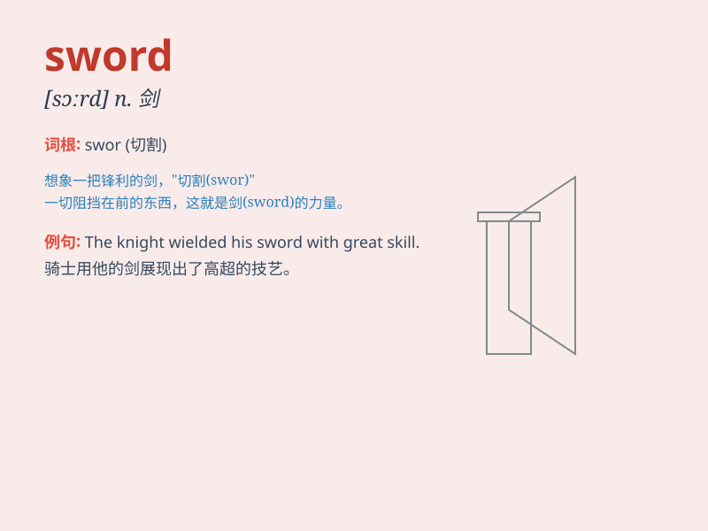

## sword

**英音:** _[sɔːd]_ **美音:** _[sɔrd]_

**译义:** *n.剑*

### 短语

+ **draw the sword:** _拔剑_

+ **put to the sword:** _杀死；使遭受屠杀_

+ **sword of Damocles:** _达摩克利斯之剑；临头的危险_

+ **double-edged sword:** _双刃剑_

+ **brandish a sword:** _挥舞剑_

### 例句

#### 例句1

> **He brandished the sword to scare away the enemy.**

**中文翻译:** 他挥舞着剑来吓跑敌人。

**单词释义:** 剑

#### 例句2

> **The knight drew his sword and charged forward.**

**中文翻译:** 这位骑士拔出他的剑并向前冲锋。

**单词释义:** 剑

#### 例句3

> **The ancient sword was on display in the museum.**

**中文翻译:** 那把古老的剑在博物馆展出。

**单词释义:** 剑

### 背诵小故事

> A brave knight was in a fierce battle. The enemy surrounded him, but
he held his sword tightly. With one powerful swing, he defeated them
all. The sword was his trusted companion and the key to victory.

**一位勇敢的骑士身处激烈的战斗中。敌人将他包围，但他紧紧握住他的剑。他猛力一挥，击败了所有人。这把剑是他信赖的伙伴，也是胜利的关键。**

### 图义

