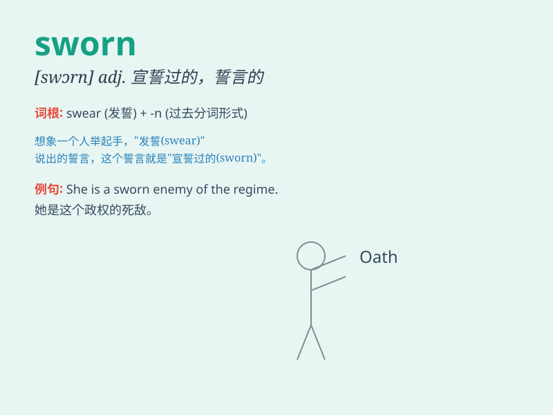

## sworn

**英音:** _[swɔːn]_ **美音:** _[swɔrn]_

**译义:** * vbl.swear的过去分词adj.宣誓过的,起誓宣布的*

### 短语

+ **sworn enemy:** _死敌；不共戴天的敌人_

+ **sworn statement:** _宣誓声明_

+ **sworn friend:** _刎颈之交；莫逆之交_

+ **sworn evidence:** _宣誓证据_

+ **sworn brother:** _结拜兄弟；盟兄弟_

### 例句

#### 例句1

> **He has sworn to keep the secret.**

**中文翻译:** 他已发誓保守这个秘密。

**单词释义:** 发誓

#### 例句2

> **They are sworn enemies.**

**中文翻译:** 他们是不共戴天的仇敌。

**单词释义:** 不共戴天的

#### 例句3

> **The witness was sworn in before giving testimony.**

**中文翻译:** 证人作证前先宣誓。

**单词释义:** 宣誓

### 背诵小故事

> A knight was sworn to protect the kingdom. He took an oath in front
of everyone and was determined to keep his promise. His sworn duty was
to fight for justice and peace.

**一位骑士发誓要保护王国。他在众人面前宣誓，决心信守承诺。他的神圣职责是为正义与和平而战。**

### 图义

