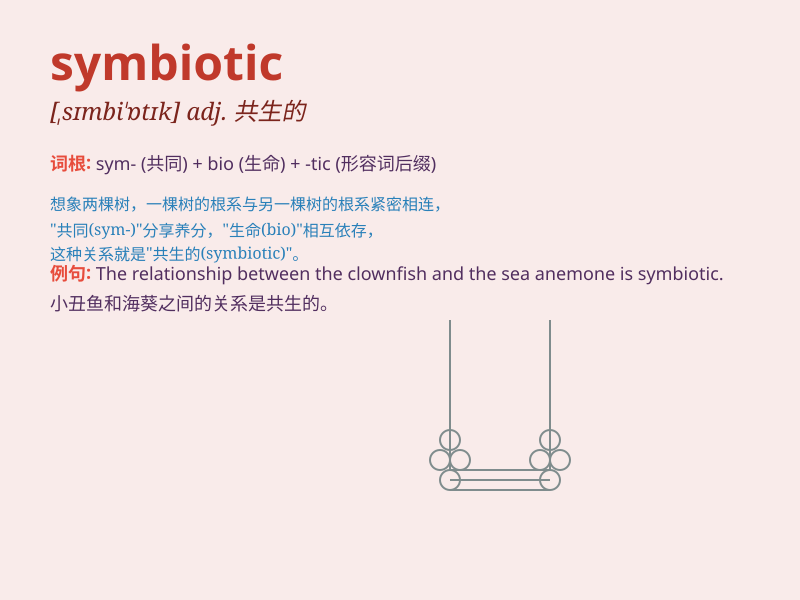

## symbiotic

**英音:** _[sɪmbaɪ\'ɒtɪk]_ **美音:** _[sɪmbaɪ\'ɑtɪk]_

**译义:** *adj.[生]共生的*

### 短语

+ **symbiotic relationship:** _共生关系_

+ **symbiotic bacteria:** _共生细菌_

+ **symbiotic association:** _共生联合_

+ **symbiotic interaction:** _共生相互作用_

+ **symbiotic system:** _共生系统_

### 例句

#### 例句1

> **The relationship between bees and flowers is symbiotic.**

**中文翻译:** 蜜蜂和花朵之间的关系是共生的。

**单词释义:** 共生的

#### 例句2

> **The symbiotic partnership between the two companies led to great
success.**

**中文翻译:** 这两家公司之间的共生伙伴关系带来了巨大的成功。

**单词释义:** 共生的；合作的

#### 例句3

> **Some marine organisms have a symbiotic existence with coral
reefs.**

**中文翻译:** 一些海洋生物与珊瑚礁有着共生的生存关系。

**单词释义:** 共生的

### 背诵小故事

> Imagine a world where fish and sea anemone have a special
relationship. The fish gets protection, and the anemone gets food. This
close and mutually beneficial connection is like a symbiotic
relationship. They depend on each other to survive.

**想象一个世界，鱼和海葵有一种特殊的关系。鱼获得保护，海葵获得食物。这种紧密且互惠的联系就像共生关系。它们相互依靠才能生存。**

### 图义

