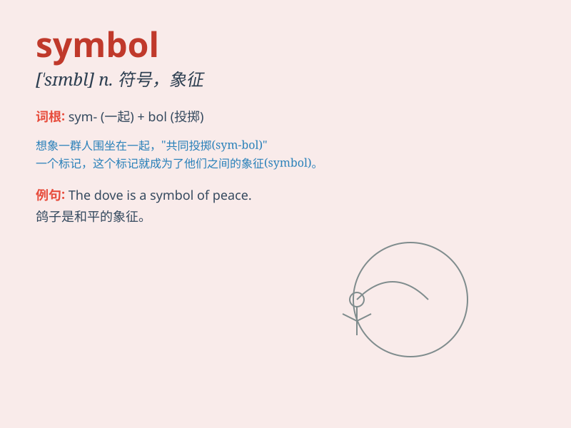

## symbol

**英音:** _[\'sɪmb(ə)l]_ **美音:** _[\'sɪmbl]_

**译义:** *n.符号,记号,象征*

### 短语

+ **symbol of:** _......的象征_

+ **religious symbol:** _宗教象征_

+ **cultural symbol:** _文化象征_

+ **mathematical symbol:** _数学符号_

+ **visual symbol:** _视觉符号_

### 例句

#### 例句1

> **The dove is a symbol of peace.**

**中文翻译:** 鸽子是和平的象征。

**单词释义:** 象征

#### 例句2

> **The red cross is an international symbol of aid and
protection.**

**中文翻译:** 红十字是援助和保护的国际象征。

**单词释义:** 象征

#### 例句3

> **In this story, the ring was a symbol of love.**

**中文翻译:** 在这个故事中，戒指是爱的象征。

**单词释义:** 象征

### 背诵小故事

> In a magical forest, there was a special tree. Every leaf on it was a
symbol. One leaf represented love, another friendship. When you found
the right leaf, you understood its meaning. The leaves were like keys to
hidden wisdom.

**在一个神奇的森林里，有一棵特别的树。树上的每片叶子都是一个象征。一片叶子代表爱，另一片代表友谊。当你找到正确的叶子，你就明白了它的含义。这些叶子就像通往隐藏智慧的钥匙。**

### 图义

