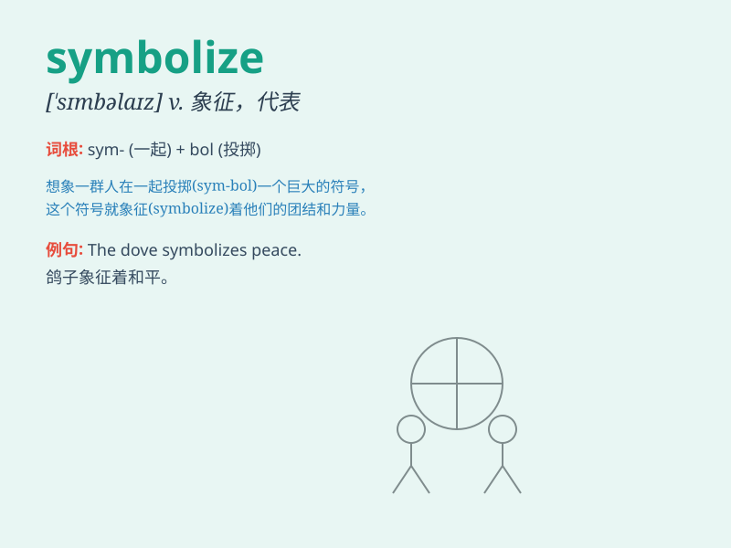

## symbolize

**英音:** _[ˈsɪmbəlaɪz]_ **美音:** _[ˈsɪmbəlaɪz]_

**译义:** *vt.象征,用符号表现vi.作为\...的象征,采用象征,使用符号*

### 短语

+ **symbolize peace:** _象征和平_

+ **symbolize love:** _象征爱情_

+ **symbolize hope:** _象征希望_

+ **symbolize victory:** _象征胜利_

+ **symbolize freedom:** _象征自由_

### 例句

#### 例句1

> **The dove symbolizes peace.**

**中文翻译:** 鸽子象征着和平。

**单词释义:** 象征

#### 例句2

> **This ring symbolizes our love.**

**中文翻译:** 这枚戒指象征着我们的爱情。

**单词释义:** 象征

#### 例句3

> **The color red often symbolizes passion and energy.**

**中文翻译:** 红色常常象征着激情和活力。

**单词释义:** 象征

### 背诵小故事

> A king wore a special crown. This crown symbolized his power and
authority. Whenever people saw the crown, they knew it meant the king\'s
rule. So, \'symbolize\' is like the crown representing the king\'s
power.

**一位国王戴着一顶特殊的王冠。这顶王冠象征着他的权力和权威。每当人们看到这顶王冠，就知道它意味着国王的统治。所以，\'symbolize\'就像王冠代表着国王的权力。**

### 图义

