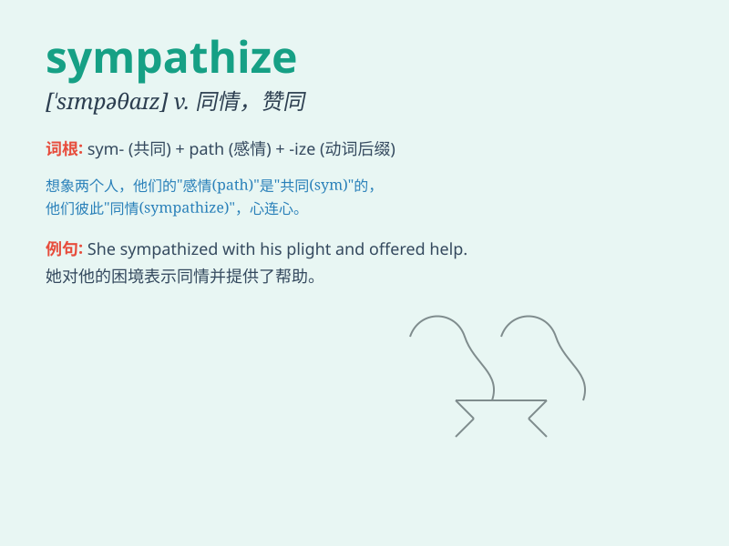

## sympathize

**英音:** _[ˈsɪmpəθaɪz]_ **美音:** _[ˈsɪmpəθaɪz]_

**译义:** *vi.同情,共鸣,同感,同意,吊唁*

### 短语

+ **sympathize with:** _同情；赞同；支持_

+ **sympathize deeply:** _深表同情_

+ **sympathize sincerely:** _真诚地同情_

+ **fail to sympathize:** _未能同情_

+ **sympathize wholeheartedly:** _全心全意地同情_

### 例句

#### 例句1

> **I sympathize with you in your loss.**

**中文翻译:** 对于你的损失，我很同情你。

**单词释义:** 同情

#### 例句2

> **He couldn\'t sympathize with her over the divorce.**

**中文翻译:** 对于她的离婚，他无法表示同情。

**单词释义:** 表示同情

#### 例句3

> **We all sympathize with the victims of the disaster.**

**中文翻译:** 我们都同情这场灾难的受害者。

**单词释义:** 同情

### 背诵小故事

> One day, when Lily saw her friend Tom crying because he lost his pet,
she felt sad with him and tried to comfort him. This is what it means to
sympathize - to share and understand someone else\'s feelings.

**有一天，当莉莉看到她的朋友汤姆因为丢失了宠物而哭泣时，她和他一起感到难过，并试图安慰他。这就是同情（sympathize）的含义------分享和理解他人的感受。**

### 图义

