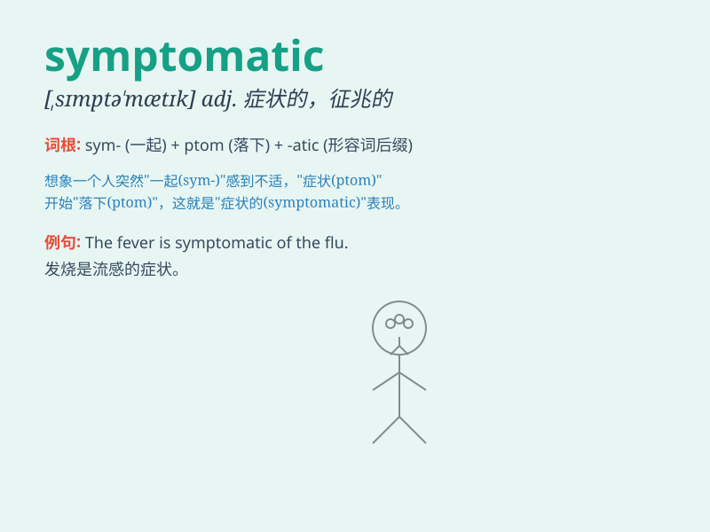

## symptomatic

**英音:** _[sɪm(p)tə\'mætɪk]_ **美音:**
_[\'sɪmptə\'mætɪk]_

**译义:** *adj.症状的,征候的,征兆的,有症状的,表明\...的症候*

### 短语

+ **symptomatic treatment:** _对症治疗_

+ **symptomatic relief:** _症状缓解_

+ **symptomatic disease:** _有症状的疾病_

+ **be symptomatic of:** _是\...\...的症状；表明\...\..._

+ **symptomatic infection:** _有症状感染_

### 例句

#### 例句1

> **The patient\'s high fever was symptomatic of a serious
infection.**

**中文翻译:** 病人的高烧是严重感染的症状。

**单词释义:** 作为\...的症状；表明

#### 例句2

> **Her frequent headaches are symptomatic of stress.**

**中文翻译:** 她频繁的头痛是压力造成的症状。

**单词释义:** 作为\...的症状；表明

#### 例句3

> **The recent economic slowdown is symptomatic of deeper problems in
the system.**

**中文翻译:** 最近的经济放缓表明了该体制存在更深层次的问题。

**单词释义:** 作为\...的症状；表明

### 背诵小故事

> A doctor was observing a patient. The patient\'s fever and cough were
symptomatic of a serious flu. The doctor knew exactly what to do based
on these symptoms.

**一位医生正在观察一位病人。病人的发烧和咳嗽是严重流感的症状。医生根据这些症状确切地知道该怎么做。**

### 图义

