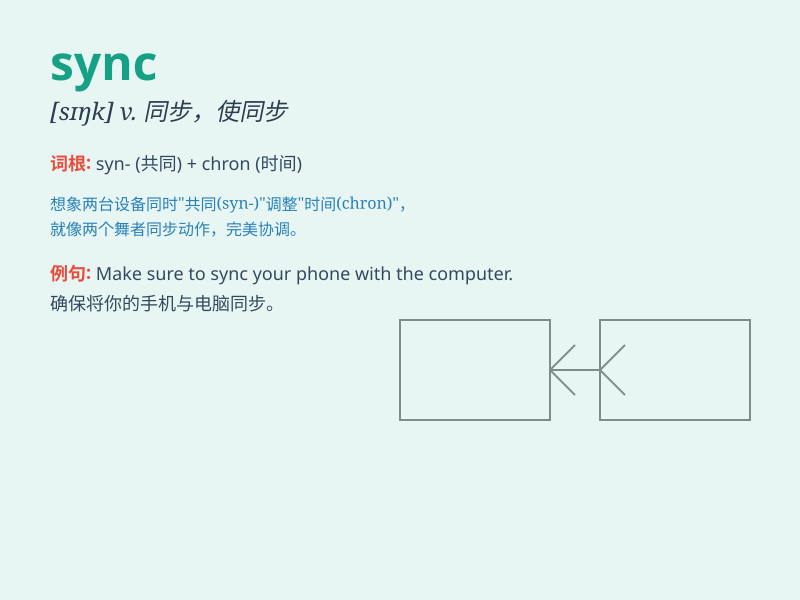

## sync

**英音:** _[sɪŋk]_ **美音:** _[sɪŋk]_

**译义:** *v. 使同步；（使）在时间上一致；协调；同时发生；n.
同时；同步*

### 短语

+ **in sync:** _同步；协调_

+ **out of sync:** _不同步；不协调_

+ **sync up:** _使同步；使协调_

+ **sync with:** _与\...\...同步；与\...\...协调_

+ **data sync:** _数据同步_

### 例句

#### 例句1

> **The music on my phone is not in sync with the video.**

**中文翻译:** 我手机上的音乐和视频不同步。

**单词释义:** 同步；协调

#### 例句2

> **We need to sync our schedules to make sure we have enough time
for the project.**

**中文翻译:**
我们需要协调我们的日程安排，以确保我们有足够的时间来完成这个项目。

**单词释义:** 使同步；使协调

#### 例句3

> **The data failed to sync between the two computers.**

**中文翻译:** 数据在两台电脑之间未能同步。

**单词释义:** 同步

### 背诵小故事

> A group of musicians were going to perform. But their instruments
were not in sync. The drummer was too fast, and the guitarist was too
slow. Finally, they practiced hard and achieved perfect sync.

**一群音乐家准备表演。但他们的乐器不同步。鼓手太快，吉他手太慢。最后，他们努力练习，实现了完美的同步。**

### 图义

