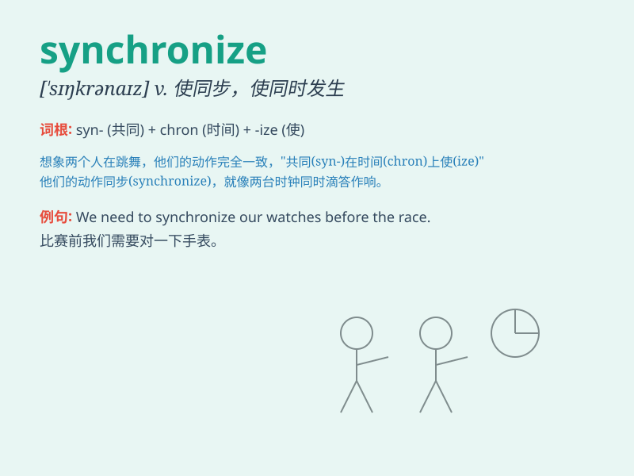

## synchronize

**英音:** _[ˈsɪŋkrənaɪz]_ **美音:** _[ˈsɪŋkrənaɪz]_

**译义:** *v.同步*

### 短语

+ **synchronize clocks:** _同步时钟_

+ **synchronize data:** _同步数据_

+ **synchronize movements:** _同步动作_

+ **synchronize schedules:** _同步日程安排_

+ **synchronize efforts:** _协同努力_

### 例句

#### 例句1

> **The dancers need to synchronize their movements perfectly.**

**中文翻译:** 舞者们需要完美地同步他们的动作。

**单词释义:** 使同步；协调

#### 例句2

> **Our watches failed to synchronize.**

**中文翻译:** 我们的手表没能同步。

**单词释义:** （使）同步；校准

#### 例句3

> **The sound and image should synchronize precisely in the film.**

**中文翻译:** 在这部电影中声音和图像应该精确同步。

**单词释义:** 使同步；使协调一致

### 背诵小故事

> A group of dancers needed to synchronize their steps perfectly for
the big show. They practiced over and over until every movement was in
harmony, just like the meaning of\'synchronize\' - to make things happen
at the same time and in the same way.

**一群舞者需要为大型演出完美地同步他们的舞步。他们反复练习，直到每个动作都协调一致，这就像'synchronize'这个单词的意思------使事物同时以相同的方式发生。**

### 图义

