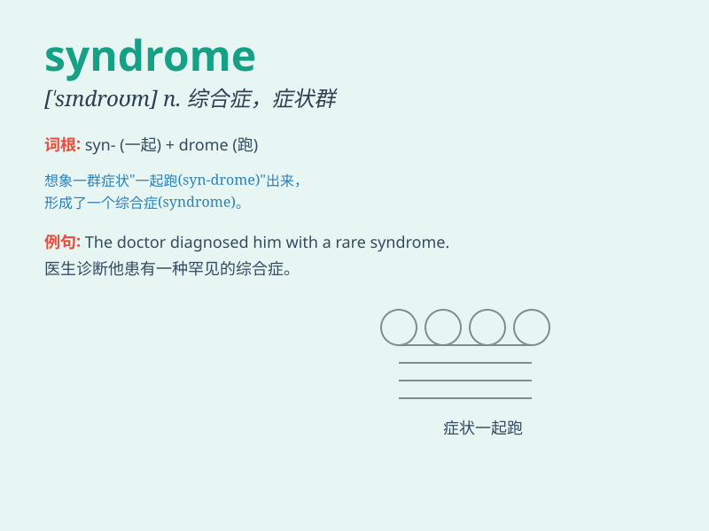

## syndrome

**英音:** _[\'sɪndrəʊm]_ **美音:** _[\'sɪndrəm]_

**译义:** *n.综合病症*

### 短语

+ **Down syndrome:** _唐氏综合征_

+ **metabolic syndrome:** _代谢综合征_

+ **chronic fatigue syndrome:** _慢性疲劳综合征_

+ **irritable bowel syndrome:** _肠易激综合征_

+ **carpal tunnel syndrome:** _腕管综合征_

### 例句

#### 例句1

> **The patient was diagnosed with Down syndrome.**

**中文翻译:** 这位患者被诊断出患有唐氏综合征。

**单词释义:** 综合征；综合症状

#### 例句2

> **She suffers from chronic fatigue syndrome.**

**中文翻译:** 她患有慢性疲劳综合征。

**单词释义:** 综合征；综合症状

#### 例句3

> **The doctor is studying a rare syndrome that affects the nervous
system.**

**中文翻译:** 这位医生正在研究一种影响神经系统的罕见综合征。

**单词释义:** 综合征；综合症状

### 背诵小故事

> A doctor was puzzled by a strange set of symptoms in a patient. After
thorough research, he realized it was a rare syndrome. This syndrome
made the patient weak and tired all the time.

**一位医生对一位患者身上的一系列奇怪症状感到困惑。经过深入研究，他意识到这是一种罕见的综合征。这种综合征让患者一直虚弱和疲倦。**

### 图义

