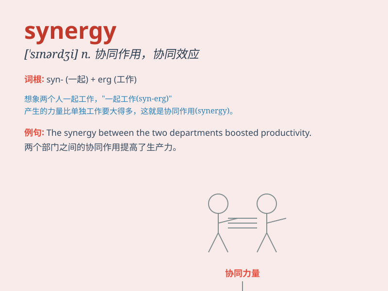

## synergy

**英音:** _[ˈsɪnərdʒi]_ **美音:** _[ˈsɪnərdʒi]_

**译义:** *n.协同作用，协同效应；（不同组织、公司等的）合作，合力*

### 短语

+ **create synergy:** _创造协同作用_

+ **synergy effect:** _协同效应_

+ **achieve synergy:** _实现协同_

+ **synergy potential:** _协同潜力_

+ **leverage synergy:** _利用协同作用_

### 例句

#### 例句1

> **The synergy between the marketing and sales teams led to a
significant increase in profits.**

**中文翻译:** 市场营销团队和销售团队之间的协同作用使得利润大幅增长。

**单词释义:** 协同作用

#### 例句2

> **We need to create synergy in our project to achieve better
results.**

**中文翻译:** 我们需要在我们的项目中创造协同效应以取得更好的结果。

**单词释义:** 协同效应

#### 例句3

> **The synergy of their talents made the band very successful.**

**中文翻译:** 他们才华的协同使得这个乐队非常成功。

**单词释义:** 协同

### 背诵小故事

>
想象一下，在一个超级英雄团队里，每个英雄都有独特的能力。当他们合作时，产生的效果远超各自单独行动，这种强大的合作力量就是\'synergy\'。就像闪电侠的速度加上绿巨人的力量，创造出无敌的组合。

**想象在超级英雄团队中合作产生的远超单独行动的强大力量来理解\'synergy\'，意为协同作用，协同增效。**

### 图义

