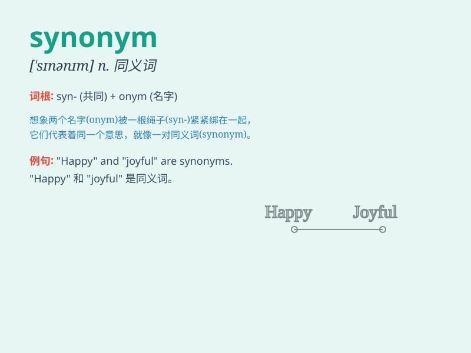

## synonym

**英音:** _[\'sɪnənɪm]_ **美音:** _[ˈsɪnənɪm]_

**译义:** *n.同义字*

### 短语

+ **synonym dictionary:** _同义词词典_

+ **find a synonym:** _找到一个同义词_

+ **common synonym:** _常见的同义词_

+ **exact synonym:** _确切的同义词_

+ **near synonym:** _近似同义词_

### 例句

#### 例句1

> **The words \'big\' and \'large\' are synonyms.**

**中文翻译:** 单词\'big\'和\'large\'是同义词。

**单词释义:** 同义词

#### 例句2

> **Can you give me a synonym for \'happy\'?**

**中文翻译:** 你能给我一个\' happy \'的同义词吗？

**单词释义:** 同义词

#### 例句3

> **In this dictionary, each word has its synonyms listed.**

**中文翻译:** 在这本字典里，每个单词都列出了它的同义词。

**单词释义:** 同义词

### 背诵小故事

> Once upon a time, a student was confused about words. A wise teacher
explained that \'synonym\' means words that have similar meanings, like
\'big\' and \'large\'. The student understood and never forgot.

**从前，有个学生对单词感到困惑。一位睿智的老师解释说，"同义词"意思是具有相似含义的单词，比如"big"和"large"。学生明白了，再也没忘记。**

### 图义

