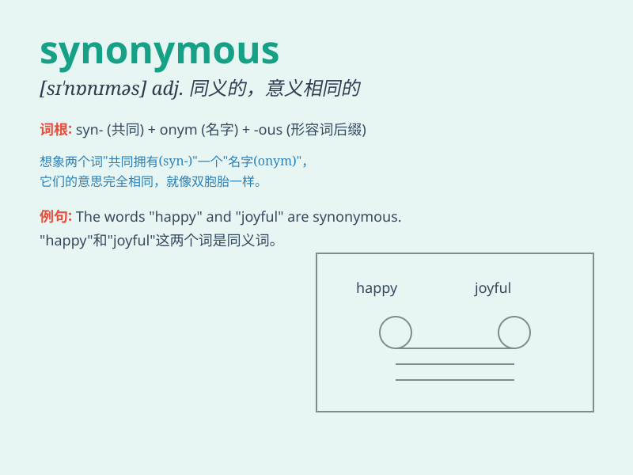

## synonymous

**英音:** _[sɪ\'nɒnɪməs]_ **美音:** _[sɪ\'nɑnɪməs]_

**译义:** *adj.同义的*

### 短语

+ **be synonymous with:** _与\...\...同义；等同于_

+ **synonymous expression:** _同义表达_

+ **synonymous words:** _同义词_

+ **almost synonymous:** _几乎同义的_

+ **synonymous relationship:** _同义关系_

### 例句

#### 例句1

> **The terms \'identical\' and\'synonymous\' are not always
interchangeable.**

**中文翻译:**
'identical'（相同的）和'synonymous'（同义的）这两个术语并不总是可以互换的。

**单词释义:** 同义的

#### 例句2

> **In this context, \'fast\' and \'quick\' are synonymous.**

**中文翻译:**
在这个语境中，'fast'（快的）和'quick'（快的）是同义的。

**单词释义:** 同义的

#### 例句3

> **The words \'wealthy\' and \'affluent\' are often considered
synonymous in economic discussions.**

**中文翻译:**
在经济讨论中，'wealthy'（富有的）和'affluent'（富裕的）这两个词常被认为是同义的。

**单词释义:** 同义的

### 背诵小故事

> A king\'s jewels were always described as precious. One day, a wise
man said \'precious\' is synonymous with \'valuable\'. The king
understood that these words had the same meaning. So, remember
\'synonymous\' means having the same meaning.

**一位国王的珠宝总是被描述为珍贵的。有一天，一位智者说"珍贵的"与"有价值的"是同义的。国王明白了这两个词意思相同。所以，记住"synonymous"意思是"同义的"。**

### 图义

