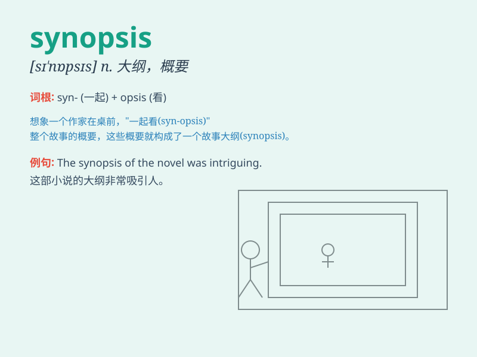

## synopsis

**英音:** _[sɪ\'nɒpsɪs]_ **美音:** _[sɪ\'nɑpsɪs]_

**译义:** *n.大纲*

### 短语

+ **general synopsis:** _概要；综述_

+ **brief synopsis:** _简短的概要_

+ **movie synopsis:** _电影简介_

+ **book synopsis:** _书籍梗概_

+ **project synopsis:** _项目概要_

### 例句

#### 例句1

> **The synopsis of the movie gave a brief overview of the plot.**

**中文翻译:** 这部电影的概要对情节进行了简要概述。

**单词释义:** 概要；大纲

#### 例句2

> **Can you provide a synopsis of the book for me?**

**中文翻译:** 你能为我提供这本书的概要吗？

**单词释义:** 概要；大纲

#### 例句3

> **The professor asked us to write a synopsis of the research
paper.**

**中文翻译:** 教授要求我们写一篇研究论文的概要。

**单词释义:** 概要；大纲

### 背诵小故事

> A detective was reading a synopsis of a mysterious case. It
summarized the key points and helped him solve the puzzle. The synopsis
was like a map guiding him through the complex story.

**一位侦探正在阅读一个神秘案件的概要。它总结了关键要点，并帮助他解决了谜团。概要就像一张地图，引导他穿过复杂的故事。**

### 图义

