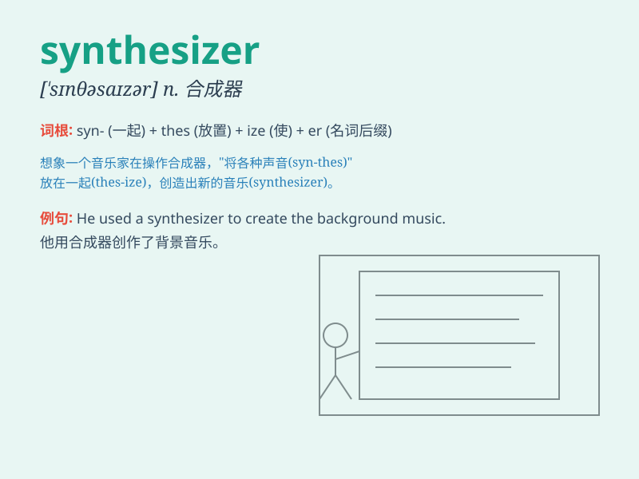

## synthesizer

**英音:** _[ˈsɪnθəsaɪzə(r)]_ **美音:** _[ˈsɪnθəsaɪzər]_

**译义:** *n.综合者,[电子]合成器*

### 短语

+ **analog synthesizer:** _模拟合成器_

+ **digital synthesizer:** _数字合成器_

+ **polyphonic synthesizer:** _复音合成器_

+ **monophonic synthesizer:** _单音合成器_

+ **software synthesizer:** _软件合成器_

### 例句

#### 例句1

> **The musician used a synthesizer to create unique sounds for the
song.**

**中文翻译:** 这位音乐家使用合成器为这首歌创造独特的声音。

**单词释义:** 合成器

#### 例句2

> **The new synthesizer has advanced features that make it highly
desirable for producers.**

**中文翻译:**
新的合成器具有先进的功能，这使得它对制作人非常有吸引力。

**单词释义:** 合成器

#### 例句3

> **She spent hours experimenting with different settings on the
synthesizer.**

**中文翻译:** 她花了几个小时在合成器上试验不同的设置。

**单词释义:** 合成器

### 背诵小故事

> One day, a scientist was working hard in the lab to create a special
machine. This machine could combine different sounds and frequencies,
and it was called a synthesizer. The scientist was very excited about
this invention.

**有一天，一位科学家在实验室里努力工作，想要制造一台特殊的机器。这台机器能够组合不同的声音和频率，它被称为合成器。这位科学家对这个发明感到非常兴奋。**

### 图义

